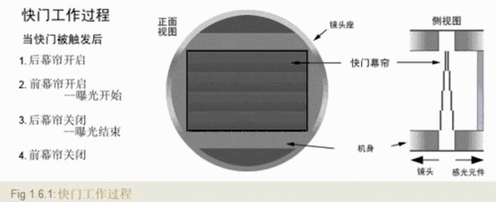
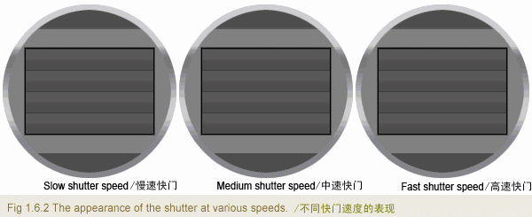
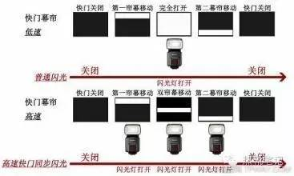
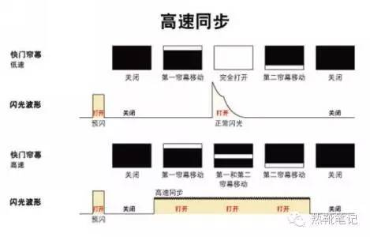
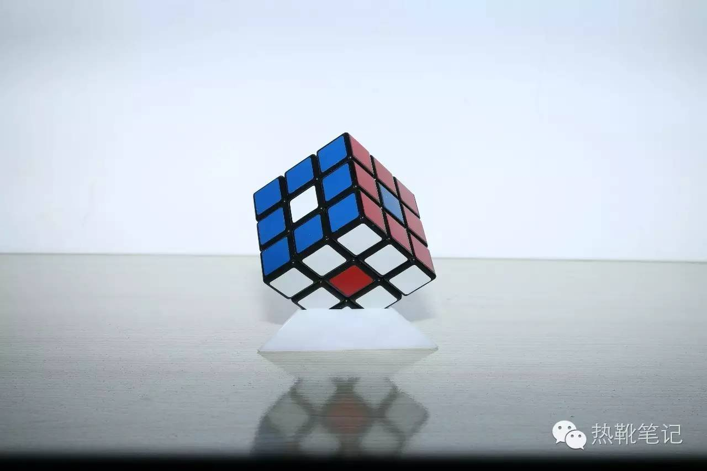

## 1. 闪光曝光补偿(`FEC`)

闪光曝光补偿(Flash Exposure Compensation, FEC), 闪光灯光量不足时，通过“闪光曝光补偿”能够增加闪光量。闪光曝光补偿**能够在不改变背景亮度的情况下增强照射被摄体的光线**。

## 2. 曝光补偿

曝光补偿是你对整张照片的明暗设定。

闪光补偿(FEC)是你对受光主体的明暗设置，相比于整张照片。闪光补偿的+-并不会影响背景的亮度，只是调整了受光主题的亮度。

## 3. 镜头测光(`TTL`)

通过镜头测光(Through The Lens, TTL)。

TTL模式是由相机和闪光灯决定输出光量的。相机与闪光灯在测量正确的曝光后，共同决定闪光灯的输出。

## 4. 预闪测光(`i-TTL`)

`i-TTL`是尼康定义的，指在闪光灯闪烁前进行*预测光*。

## 5. 频闪

频闪摄影又称连闪摄影，是借助于频闪光源的连续闪光，在一张底片上记录动体的连续运动过程。

相机开B门，找个背景黑暗的地方，而后主体开始做动作，闪光灯闪N次就会在一张底片上留下N个影像。


## 6. GN60

闪光灯指数(Guide Numbers)，越大则光量越大。一般都会以ISO100的情况下，标出GN值。

```js
GN = 光圈值 * 闪光有效距离(m)

// e.g 光圈给f/4时，有效闪光距离为15米
GN60 = f/4 * 15m
```

```js
新GN指数 = 原GN指数 * Math.sqrt( ISO / 100 )

// e.g
GN60 = GN60 * Math.sqrt( ISO100 / 100)

// 当把ISO调整到400时，GN指数就变成了GN120，即闪光指数翻倍了
GN120 = GN60 * Math.sqrt( ISO400 / 100)
```

## 7. 高速同步

如果快门速度比闪光同步速度慢，整个画面都能接收到闪光灯的光线—闪光同步；

如果快门速度比闪光同步速度快，画面**只能部分**接收到闪光灯的光线—高速同步。

### 7.1 快门工作原理

慢速：



不同快门速度对比：



### 7.2 闪光灯与快门

普通同步与高速同步幕帘快门工作的区别：





> 注意：闪光灯并不是持续发光的，而是频闪的。

### 7.3 高速同步有多重要？

当逐步提高快门速度时（一般超过`1/250s`就要开启高速闪光同步了），一旦闪光灯速度比快门速度慢，就会有如下效果：





ref: https://zhuanlan.zhihu.com/p/25947723