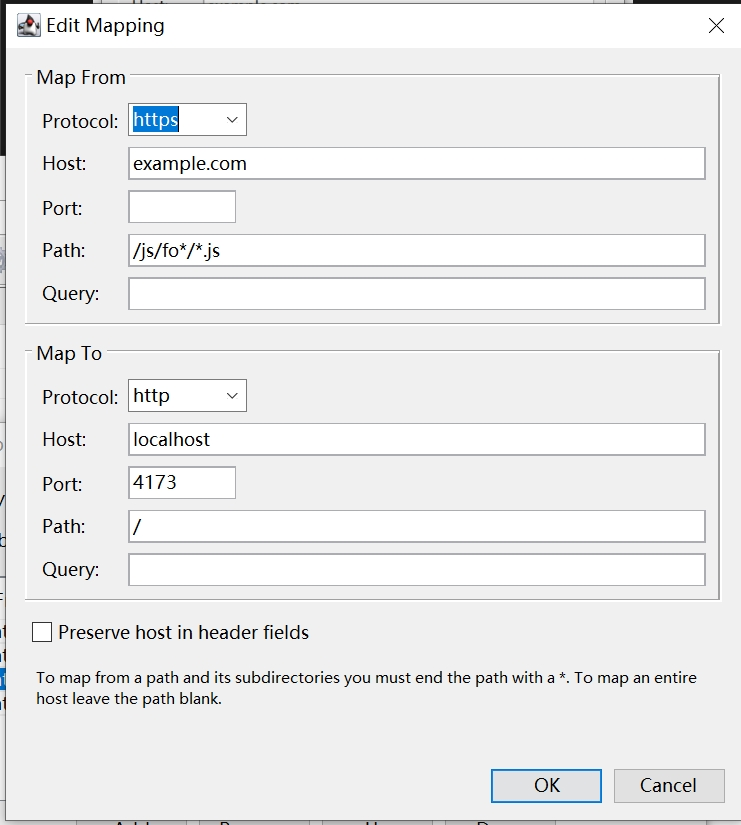
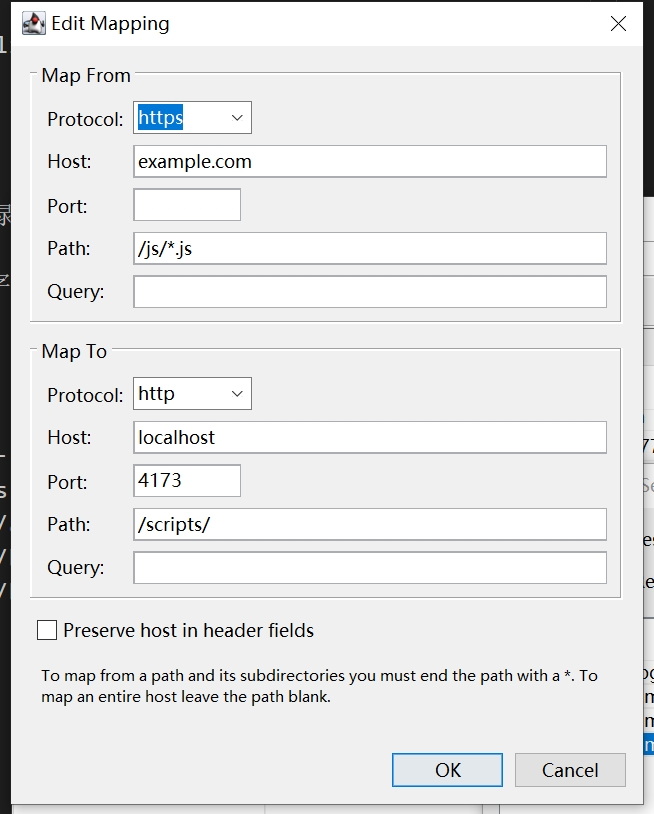
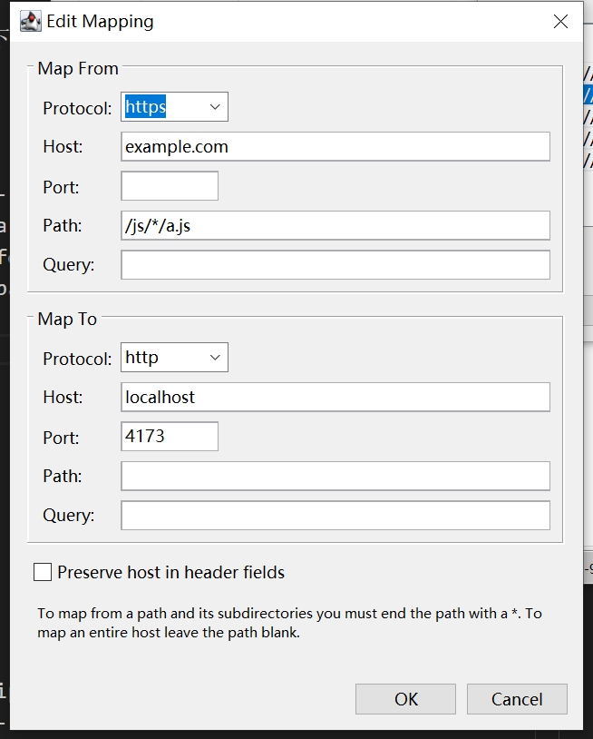
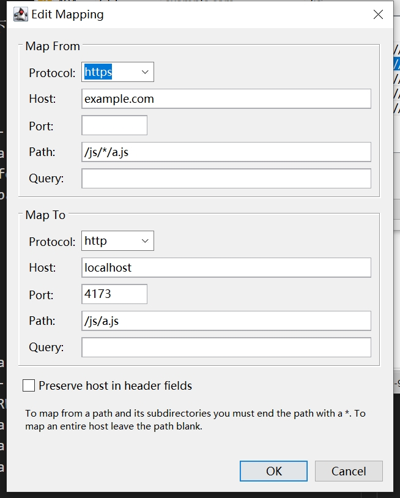
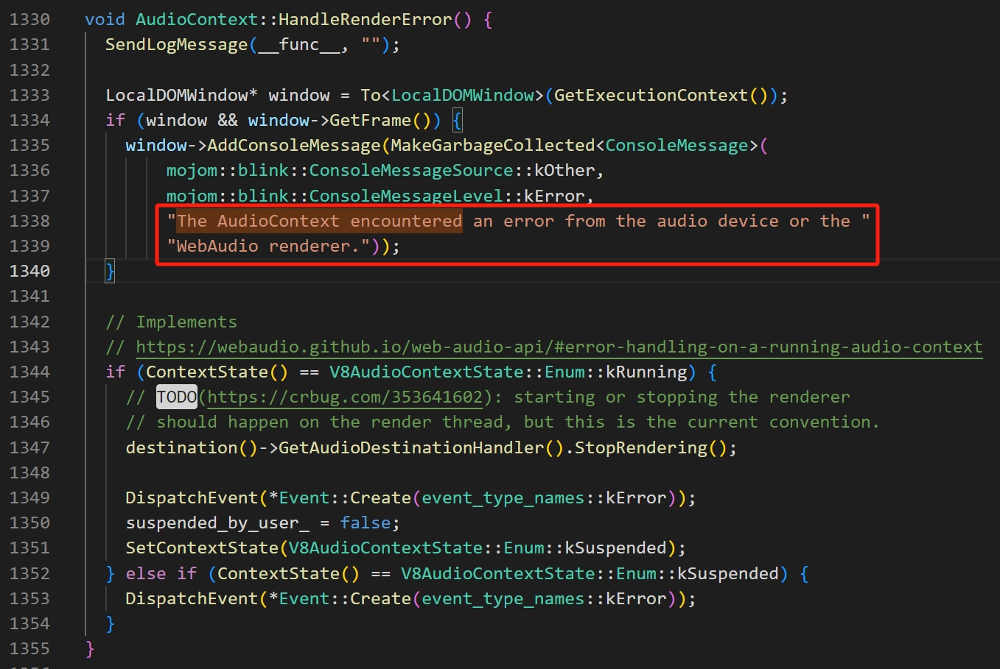
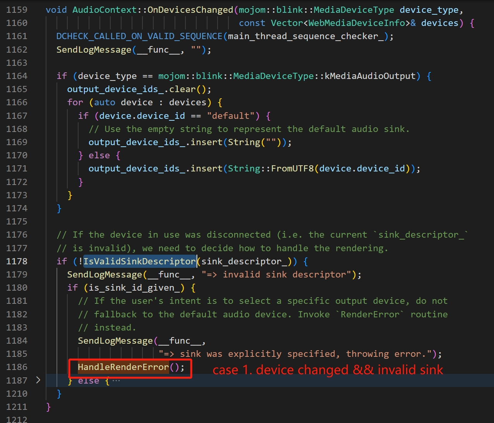
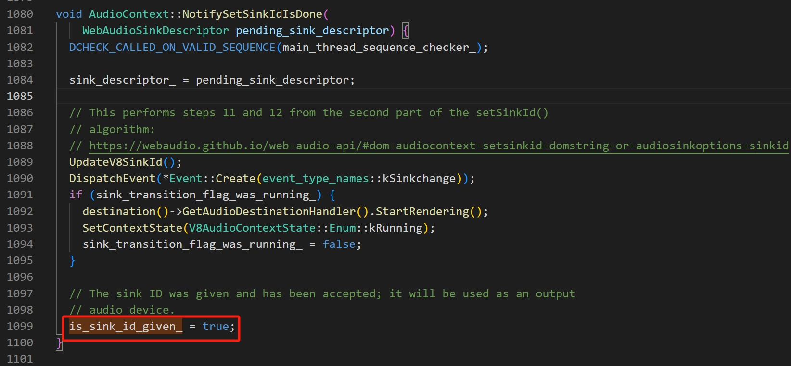
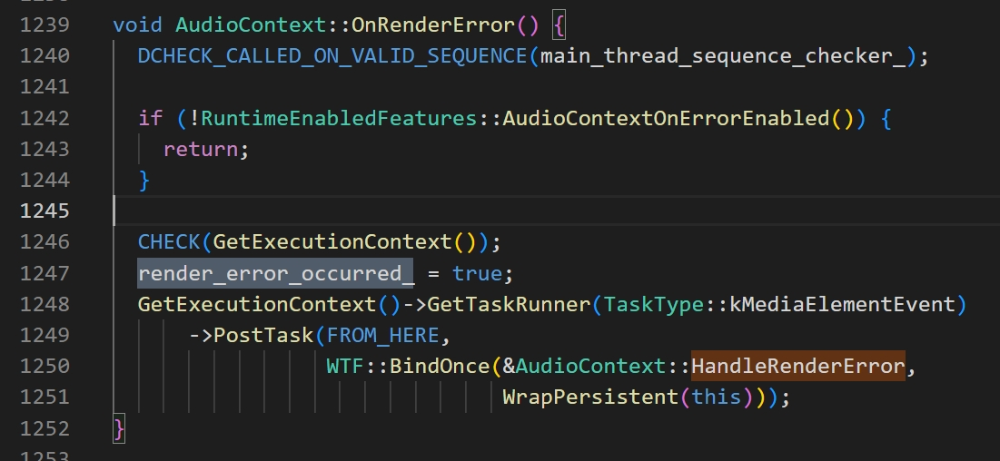
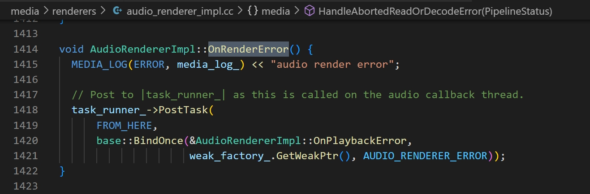

> - If you don't specify a path in the destination mapping then the path part of the URL will not be changed (Map To的path如果留空，则源path会保留)
> 
> 
> - If you want to map to the root directory, put a / in the destination path field.（如果想Map到目标根目录，要给Map To的path填`/`，所有匹配的文件都会落到根目录）
>
> - (以下都我自己琢磨的) If you want to map to a given directory, the matched part in path of the source URL will be appended to your given directory（若要map到指定目录下，则匹配的path部分会被追加到指定目录下。匹配的部分是指，path匹配可变的部分直到url末尾。见case4）
>
> - If you want to map from directory to another directory, make sure to appended a `*` to the source path.（如果要目录映射到目录，要给源path后加一个`*`。见case5）
>
> - If you want to map a name-known file, the Map To's path must be left empty(the source path will be appended to target host), or Map To's path must be a specified file(the file will be served to that request). （如果要映射某个具体的文件，知道了文件名，但不知道具体的路径，只有两种方法：要么Map To的path留空，这样就带着源path映射；要么也写一个带文件名的具体路径。据测试似乎不能map到某个目录下。见case6）
> - 注意匹配一个具体的文件，和匹配一个目录下的*文件，是不一样的。

## File pattern
### case 1. map `*.js` file to another domain
> 注意这里的`*`代表任意字符，即 >=1 个**任意**字符，所以它可以匹配多级目录。
>
> 当`*`作为0个字符匹配时，如果path不合法，则应该是不允许的；如果能当作空字符处理，则可以。见case3。
>
> 由于Map To的`path`留空了，所以源path会被保留
```
example.com/*.js                             ->  localhost:4173
--------------------------------------------------------------------------------
example.com/a.js                             ->  localhost:4173/a.js
example.com/foo/a.js                         ->  localhost:4173/foo/a.js   
example.com/foo/bar/a.js                     ->  localhost:4173/foo/bar/a.js
example.com/foo/bar/barz/a.js                ->  localhost:4173/foo/bar/barz/a.js
```


### case 2. map nested directory's `*.js` file to root directory
> 这里匹配js目录的孙子目录及更深层的js
> 由于Map To的`path`为`/`，即匹配和的js文件，将落到目标域名根目录下的同名文件
```
example.com/js/*/*.js                        ->  localhost:4173/
--------------------------------------------------------------------------------
example.com/js/foo/a.js                      ->  localhost:4173/a.js
example.com/js/bar/c.js                      ->  localhost:4173/c.js
example.com/js/bar2/sdf/bar4/a.js            ->  localhost:4173/a.js
example.com/js/a.js                          ->  DOES NOT MATCH, FORWARD TO ORIGIN SERVER
```


### case 3. map given rule for the nested directory's `*.js` file to root directory
> 这里匹配`/js/fo*/`目录下的所有*.js文件（包含更深目录层级）
>
> 注意这个匹配的目录有多种情况。
>
> 而且`/fo*/`是可以匹配`/fo/`的
```
example.com/js/fo*/*.js                      ->  localhost:4173/
--------------------------------------------------------------------------------
example.com/js/foo/a.js                      ->  localhost:4173/a.js
example.com/js/fo/a.js                       ->  localhost:4173/a.js
example.com/js/fo/abc.js                     ->  localhost:4173/abc.js
example.com/js/fu/a.js                       ->  DOES NOT MATCH, FORWARD TO ORIGIN SERVER
example.com/js/fo/bar/a.js                   ->  localhost:4173/a.js
example.com/js/foo/bar/baz/a.js              ->  localhost:4173/a.js
example.com/js/a.js                          ->  DOES NOT MATCH, FORWARD TO ORIGIN SERVER
```


### case 4. map `*.js` file to a given directory
> 这里把js目录下的所有*.js文件（包含更深目录层级），全都统一匹配到 scripts 目录下
>
> 注意别忘了Map To `path`后的`/`
> 
> <p style='color:red'>源路径的**wildcard匹配部分**，会被拼接到目标path后</p>
```
example.com/js/*.js                          ->  localhost:4173/scripts/
--------------------------------------------------------------------------------
example.com/js/a.js                          ->  localhost:4173/scripts/a.js
example.com/js/foo/a.js                      ->  localhost:4173/scripts/foo/a.js
example.com/js/bar2/sdf/bar4/a.js            ->  localhost:4173/scripts/bar2/sdf/bar4/a.js
```


### case 6. map a specific `a.js` file to target domain
> 这里把js目录下的某个a.js文件（包含更深目录层级），匹配到target domain下的相同path
>
> 注意target path留空，所以源path保留了。
```
example.com/js/*/a.js                        ->  localhost:4173
--------------------------------------------------------------------------------
example.com/js/a.js                          ->  localhost:4173/js/a.js
example.com/js/foo/a.js                      ->  localhost:4173/js/foo/a.js
example.com/js/bar2/sdf/bar4/a.js            ->  localhost:4173/js/bar2/sdf/bar4/a.js
```


### case 7. map a specific `a.js` file to a specific file
> 这里把js目录下的某个a.js文件（包含更深目录层级），匹配到具体的一个文件
>
```
example.com/js/*/a.js                        ->  localhost:4173/js/a.js
--------------------------------------------------------------------------------
example.com/js/a.js                          ->  DOES NOT MATCH, FORWARD TO ORIGIN SERVER
example.com/js/foo/a.js                      ->  localhost:4173/js/a.js
example.com/js/foo/bar/a.js                  ->  localhost:4173/js/a.js
example.com/js/bar2/sdf/bar4/a.js            ->  localhost:4173/js/a.js
```



## Directory
### case 5. map the `js` directory to a given `scripts` directory
> 整个把js目录下匹配到 scripts 目录下
>
> <p style='color:red'>注意，一定要给源path后加上`*`</p>
```
example.com/js/*                             ->  localhost:4173/scripts/
--------------------------------------------------------------------------------
example.com/js/a.js                          ->  localhost:4173/scripts/a.js
example.com/js/foo/a.js                      ->  localhost:4173/scripts/foo/a.js
example.com/js/bar2/sdf/bar4/a.js            ->  localhost:4173/scripts/bar2/sdf/bar4/a.js
```


----


## Android Mobile报错

AudioContext::SendLogMessage - 
WebRtcLogMessage - add |message| to the diagnostic WebRTC log, if started



Apparently, the error log comes from the associated AudioContext which should be the one on which current media relies.

So what's the stack trace?

case 1. device disconnected


must have `is_sink_id_given_` to be true. but that is set at here:


so we shall add an event listener for `AudioContext.onsinkchange`:
```js
audioCtx.addEventListener("sinkchange", () => {
  if (typeof audioCtx.sinkId === "object" && audioCtx.sinkId.type === "none") {
    console.log("Audio changed to not play on any device");
  } else {
    console.log(`Audio output device changed to ${audioCtx.sinkId}`);
  }
});
```

or, we can get it directly from `audioCtx.sinkId` to see whether it's invalid(slient or exists in the list of output devices).

It none of them satisfies, then case 1 is impossible.

`WebAudioSinkDescriptor` is a class that wrap the sink related properties.
- type: kAudible | kSilent
- sinkId: string
- token: ???


`RealtimeAudioDestinationHandler` holds a reference to audio context object that can be retrieved by `Context()`.


case 2. onRenderError



可能有关的地方：



RealtimeAudioDestinationHandler::OnRenderError()
  AudioContext::OnRenderError()
    // DVLOG(2)
    "The AudioContext encountered an error from the audio device or the "
        "WebAudio renderer."


要看chromium的log，
首先开启log开关
NDEBUG == false || DCHECK_ALWAYS_ON == true

>
> DCHECK, the "debug mode" check
>
> NDEBUG: no debug
> 

其次设置verbose level `ENABLED_VLOG_LEVEL`（默认为-1）
只要日志的级别 <= ENABLED_VLOG_LEVEL
通过DVLOG打log的都会打印

ERROR: 0
KEY: 1 ??
INFO: 2 ??
VERBOSE: 3 ??

"/C/Program Files/Google/Chrome/Application/chrome.exe" --enable-logging=stderr --v=3 --log-level=0 --vmodule=media=2,content=2,blink=2


## NeatFrame报错: `MEDIA_ERR_DECODE`

The callback would trigger the error.
- WebMediaPlayerMS::OnAudioRenderErrorCallback (ready_state_ != WebMediaPlayer::kReadyStateHaveNothing)
  - HTMLMediaElement::SetNetworkState
    - HTMLMediaElement::MediaLoadingFailed (kNetworkStateDecodeError)
      - HTMLMediaElement::MediaEngineError

Then there were 2 cases here(they might trigger the callback):
- ? no references?
  - WebMediaPlayerMS::**Load**
    - renderer_factory_->GetAudioRenderer(..., callback)

- ? both have no references? browser will call them ?
  - MediaElementEventListener::Invoke or HTMLMediaElementCapture::captureStream
    - CreateHTMLAudioElementCapturer
      - MediaStreamDescriptor::AddRemoteTrack(MediaStreamComponent*)
        - MediaStreamDescriptor::AddComponent(MediaStreamComponent*) or MediaStreamDescriptor::RemoveComponent(MediaStreamComponent*) // MediaStreamComponent有个id，和 MediaStreamTrack.id 相同。A MediaStreamComponent is a MediaStreamTrack
          - WebMediaPlayerMS::TrackAdded or WebMediaPlayerMS::TrackRemoved
            - WebMediaPlayerMS::**Reload**()
              - WebMediaPlayerMS::ReloadAudio()
                - renderer_factory_->GetAudioRenderer(..., callback)


