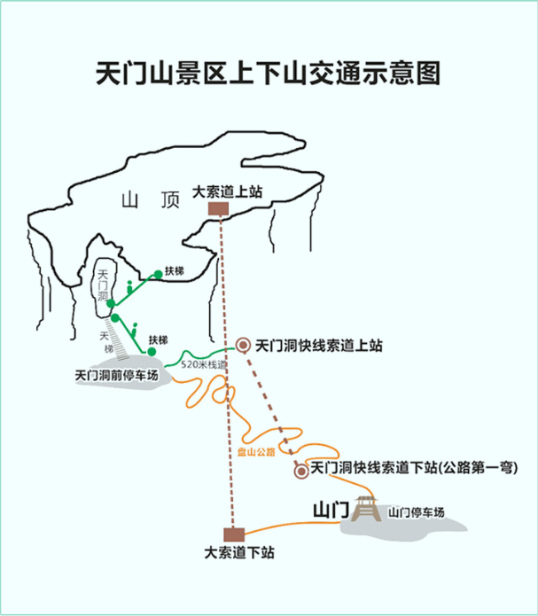
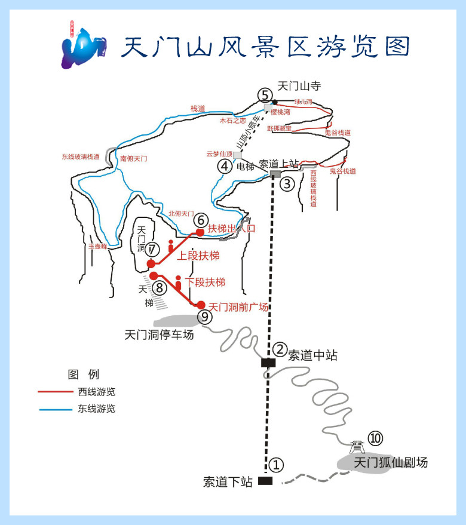

## 婚礼前

### 1、D0（4.27）：深圳->郴州（480km）

下午请半天假，中午吃完饭后出发。

14:00-20:00（**480km**，6h）

乐广高速`G0423`

### 2、D1（4.28）：郴州->长沙->荆州（630km）

07:30-11:30（**300km**，4h）

长沙小休5h

方案有二：
西边G55二广高速，常德(170km)
东边G0421许广高速，岳阳（也差不多）

17:00-21:00 长沙->荆州（**330km**, 4h）

### 3、D2（4.29）：荆州->襄阳->十堰->西安（680km）

9:00-11:30 到襄阳（**200km**），午饭

14:30-19:00 到商洛市山阳县（**330km**），晚饭

20:00-22:00 到家（**150km**）

### 4、D3（4.30）: 婚礼方案会议

## 婚礼

### 1、D4（5.1）：休息

### 2、D5（5.2）：收拾

### 3、D6（5.3）：彩排

### 4、D7（5.4）：婚礼

### 5、D8（5.5）：缓冲

### 婚礼后

### 1、D9（5.6）- D17（5.14）：8天蜜月

### 2、D18（5.15）- D19（5.16）：2天休息

## 蜜月

时间：5.6~5.16

|地点|耗时|门票|开放时间|备注|
|-|-|-|-|-|
|西双版纳-中国科学院西双版纳热带植物园|3h|80|08:00-18:00|游览车东西园区各50（全园100）|
|西双版纳-曼听公园|2h|40|08:00-18:00|曾是版纳傣王的御花园|
|西双版纳-热带雨林国家公园望天树景区|2h|55|08:30-18:00|套票：198，包含景区大门票+单程南腊河观光游船票+树冠走廊/雨林廊桥|
|西双版纳-西双版纳热带花卉园|2h|54|7:30-18:00|-|
|-|-|-|-|

香格里拉
2d

青海湖
-3～12度

稻城亚丁
十月中下旬

## 张家界

### 天门山

1. 上山：从市区的**天门山索道（下站）**坐索道，直接到**天门山顶原始空中花园（上站）**，距离7455m，耗时`30min`。

2. 游览山顶：到达山顶后，分东西线，走西线。

    西线细节：
    - 西线玻璃栈道`60m`
    - 鬼谷栈道`1.6km`
    - 天门山悬索桥
    - 求儿洞
    - 天门山寺(山顶)
    - 樱桃湾餐厅（**可坐小缆车¥32，也可步行下到穿山扶梯入口**）
    - 可继续走东线...

3. 下山：乘坐**穿山扶梯（上段）**（贼长的扶手电梯）下到**天门洞**（就是索道中站），从天门洞下楼梯999级到**天门洞广场**，再经过`520m`的栈道走到**天门洞快线索道（上站）**，乘坐之下到**山门**。

4. 回到起点：在**山门**乘坐**景区摆渡车**返回到市区内的**天门山索道（下站）**。

### 张家界