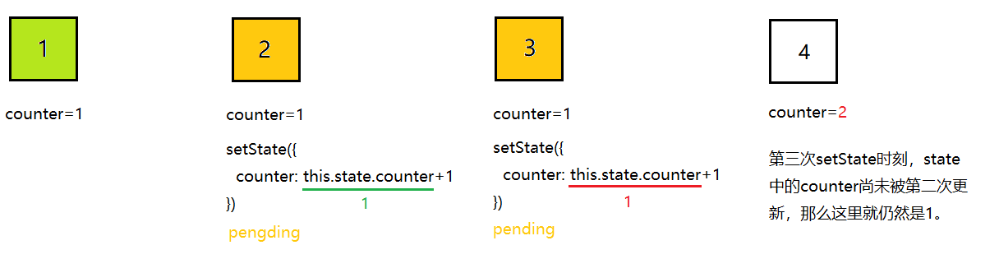

# Learning React
===React相关知识点===

*在vscode中，按下F1键以调出命令，输入`create content table`来创建目录。*

- [Learning React](#learning-react)
  - [1. JSX](#1-jsx)
    - [1.1 可以嵌入表达式](#11-可以嵌入表达式)
    - [1.2 JSX中的属性](#12-jsx中的属性)
    - [1.3 JSX中的用户输入部分是安全的](#13-jsx中的用户输入部分是安全的)
    - [1.4 JSX其实是个语法糖](#14-jsx其实是个语法糖)
  - [2. 快让我们用上JSX！](#2-快让我们用上jsx)
    - [2.1 引入React library](#21-引入react-library)
    - [2.2 引入babel](#22-引入babel)
    - [2.3 在HTML中使用jsx](#23-在html中使用jsx)
    - [2.4 jsx预处理器(JSX preprocessor)](#24-jsx预处理器jsx-preprocessor)
  - [3. 渲染React Element](#3-渲染react-element)
  - [4. Components和Props](#4-components和props)
    - [4.1 这就是一个*React Component*](#41-这就是一个react-component)
    - [4.2 使用组件渲染](#42-使用组件渲染)
    - [4.3 组件也可以引用另一个组件](#43-组件也可以引用另一个组件)
    - [4.4 `props` are Read-Only](#44-props-are-read-only)
  - [5. 使用`setState`来更新DOM](#5-使用setstate来更新dom)
    - [5.1 一个错误的例子](#51-一个错误的例子)
    - [5.2 `state`来了！](#52-state来了)
      - [5.2.1 将function component转换为class component](#521-将function-component转换为class-component)
      - [5.2.2 添加local state](#522-添加local-state)
      - [5.2.3 添加lifecycle methods](#523-添加lifecycle-methods)
      - [5.2.4 关键的更新操作：`setState`](#524-关键的更新操作setstate)
    - [5.3 关于`state`的注意点](#53-关于state的注意点)
  - [6. Handling Events](#6-handling-events)
  - [7. 条件渲染(Conditional Rendering)](#7-条件渲染conditional-rendering)
  - [8. Lists and Keys](#8-lists-and-keys)
    - [8.1 原理](#81-原理)
    - [8.2 但是为什么不建议用index呢？](#82-但是为什么不建议用index呢)
    - [8.3 什么是`key`？](#83-什么是key)
  - [9. Forms](#9-forms)
    - [9.1 Controlled Components](#91-controlled-components)
    - [9.2 Uncontrolled Components（React大多情况下推荐用此类组件实现Form）](#92-uncontrolled-componentsreact大多情况下推荐用此类组件实现form)
  - [11. 组合替代继承](#11-组合替代继承)
  - [12. React.Fragment](#12-reactfragment)
  - [13. Forwarding Refs](#13-forwarding-refs)
  - [14. HOC(Higher-Order Components)](#14-hochigher-order-components)
  - [15. Code-Splitting](#15-code-splitting)
  - [16. The Component Lifecycle](#16-the-component-lifecycle)
  - [17.JSX In Depth](#17jsx-in-depth)
  - [22. Hooks](#22-hooks)
    - [22.1 什么是hooks？](#221-什么是hooks)
    - [22.2 State Hook: `useState`](#222-state-hook-usestate)
    - [22.3 Effect Hook: `useEffect`](#223-effect-hook-useeffect)
  - [Q&A](#qa)
    - [1. `React.FC`是啥？](#1-reactfc是啥)

## 1. JSX

```jsx
const element = <h1>Hello, world!</h1>;
```

这就是JSX语法，`.jsx`是对JS的一种扩展，用于在React应用中描述UI。

最终会处理为**React元素**(React Element)，赋值给了变量`element`。

### 1.1 可以嵌入表达式

任何合法的*javascript expression*都可以嵌入到`.jsx`里的`{}`中。

```jsx
const name = 'yu hui';
const element = <h1>Hello, {name}!</h1>;

function getFirstName(name) {
  return name.substring(0, name.indexOf(' '));
}

const element2 = (
  <h1>
    Hello again, {getFirstName(name)}!
  </h1>
);
// will result in <h1>Hello again, yu!</h1>
```

**注意**:

在需要跨行书写JSX时，应当用`()`包裹一下，以避免自动的`;`被添加到行尾而导致语法错误。

### 1.2 JSX中的属性

字符串值类型，用*引号*(`'`或`"`)包裹：

```jsx
const element = <div myAttr="pretty"></div>;
```

JS表达式类型，用*花括号*(`{}`)包裹：

```jsx
const element = </img>;
```

> React DOM使用`camelCase`命名方式，如`class`变为`className`，`tab-index`变为`tabIndex`。

### 1.3 JSX中的用户输入部分是安全的

可以将用户输入写进JSX：

```jsx
const title = response.potentiallyMaliciousInput;
// This is safe:
const element = <h1>{title}</h1>;
```

**因为React在渲染之前，会将JSX中嵌入的值都进行escape(转义)。**

参见：[JSX Prevents Injection Attacks](https://reactjs.org/docs/introducing-jsx.html#jsx-prevents-injection-attacks)

### 1.4 JSX其实是个语法糖

**Babel**将会对JSX编译成对`React.createElement()`的调用。

```jsx
const element = (
  <h1 className="greeting">
    Hello, world!
  </h1>
);
```

等价于：

```js
const element = React.createElement(
  'h1',
  {className: 'greeting'},
  'Hello, world!'
);
```

`element`就是React元素。

注意和`Component`区分，`element`是构成`Component`的要素。

## 2. 快让我们用上JSX！

说了这么多，也该用`.jsx`练手了。

### 2.1 引入React library

**React**也是一个js库而已，通过`<script>`标签加载它：

```html
  <!-- Load React. -->
  <!-- Note: when deploying, replace "development.js" with "production.min.js". -->
  <script src="https://unpkg.com/react@17/umd/react.development.js" crossorigin></script>
  <script src="https://unpkg.com/react-dom@17/umd/react-dom.development.js" crossorigin></script>
```

问题：React vs React DOM ?

React用于更容易地构建用户界面，它和web、浏览器没直接的耦合，
比如我们用的`component`, `classes`, `elements`就属于React js库；


React DOM则是将React和browser粘合在一起，比如我们用到的`render()`或`findDOMNode()`就属于React DOM。

### 2.2 引入babel

**Babel**用来将对`.jsx`进行语法分析，并转换为`.js`。它的存在就是为了我们用*JSX*写起来爽一点，但毕竟要运行在浏览器中，需要由它帮忙转换为`.js`。

```html
  <script src="https://unpkg.com/babel-standalone@6/babel.min.js"></script>
```

有了上面的babel的引入，我们可以在*type*为`type=text/babel`的`<script>`标签中书写jsx语法了。

```html
  <script type='text/babel'>
    // using JSX syntax
    const element = <h1>Hello world!</h1>;
  </script>
```

### 2.3 在HTML中使用jsx

见：[在HTML中使用jsx](./using-jsx(1)/jsx-in-script-tag-with-text-babel.html)。

### 2.4 jsx预处理器(JSX preprocessor)

前置条件：
- `npm` required

安装步骤：

    npm init -y
    npm install babel-cli@6 babel-preset-react-app@3

关于命令解释，请查看[npm学习笔记](../learn.md)。

运行JSX预处理器：

    npx babel --watch src --out-dir . --presets react-app/prod

当把`.jsx`文件丢进`src`文件夹中后，`.jsx`会被*babel*立即转换为`.js`（输出到`--out-dir`指定的目录）以支持在浏览器中运行。这玩意就是*Babel*！屌！

    --presets

这个是"预置"的意思，看文档描述似乎是babel编译时，所用到的一些插件。（可能就是辅助编译？）

## 3. 渲染React Element

传入`element`及所要渲染到的根元素(a root DOM node)。
```html
  const element = <h1>Hi yuhui</h1>;
  ReactDom.render(element, document.getElementById('root'));
```

React element是不可变的，一旦创建好无法修改。

## 4. Components和Props

### 4.1 这就是一个*React Component*

```jsx
function Welcome(props) {
  return <h1>Hello, {props.name}</h1>;
}
```

接受一个输入参数`props`，返回一个`React Element`，这样的函数就是一个React的***Function Component***。

> When React sees an element representing a user-defined component, it passes JSX **attributes** and **children** to this component as a single object. We call this object “`props`”.

当然，也可以用*Class*来实现：

```jsx
class Welcome extends React.Component {
  render() {
    return <h1>Hello, {this.props.name}</h1>;
  }
}
```

从`React.Component`继承，并实现`render()`方法返回一个*React Element*，那么这样的一个类`Welcome`就是React的***Class Component***。

**注意**：
- *Component*的命名必须**首字母大写**

ref: [jsx in depth](https://reactjs.org/docs/jsx-in-depth.html#user-defined-components-must-be-capitalized)

### 4.2 使用组件渲染

```jsx
// 定义函数组件
function Welcome(props) {
  return <h1>Hello, {props.name}</h1>;
}

// 使用组件渲染
// html
<div id='root'></div>

// script
const elem = <Welcome name='yuhui' />;
ReactDOM.render(
  elem,
  document.getElementById('root'),
);
```

来看看上述是怎么工作的：
1. `Welcome`是一个*function component*，React调用这个函数组件并传参数`{ name: "yuhui" }`；

2. `Welcome`组件返回*React element*为

```html
    <h1>Hello, yuhui</h1>;
```
3. 最终ReactDOM调用`render`渲染出DOM。

### 4.3 组件也可以引用另一个组件

```jsx
function Welcome(props) {
  return <h1>hi, {props.name}</h1>;
}

// 在App组件内引用另一个组件Welcome
function App() {
  return (
    <div>
      <Welcome name='yuhui' />
      <Welcome name='yunhui' />
      <Welcome name='xiaohan' />
    </div>
  );
}

// 渲染App
<div id='root'></div>

const elem = <App />
ReactDOM.render(
  elem,
  document.getElementById('root'),
);

```

### 4.4 `props` are Read-Only

什么是*pure function*?

不修改输入参数的函数，而且对于相同的参数，都返回相同的结果，这种函数就叫做**纯函数**(*pure function*)。

比如`sum`就是一个*pure function*。

```js
function sum(a, b) {
  return a + b;
}
```

相对地，以下就是*impure function*：

```js
function withdraw(account, amount) {
  account.total -= amount;
}
```

因为它修改了入参*account*。

***所有React组件都应该是pure function***。

## 5. 使用`setState`来更新DOM

### 5.1 一个错误的例子

我们知道，

> React elements are **immutable**. Once you create an element, you can’t change its children or attributes. 

所以这样写是不能更新`<clock>`的：

```jsx
// 定义clock
function Clock(props) {
  let timeString = new Date().toLocaleTimeString();
  setInterval(() => {
    timeString = new Date().toLocaleTimeString();
  }, 1000);

  return (
    <div>
      <h2>It is {timeString}.</h2>
    </div>
  );
}

// 渲染
<div id='root'></div>

const clockElem = <Clock />;

// 在这里，clockElem被创建好后，就是Immutable！所以即使修改了其内部变量，也不会更新这个React Element
ReactDOM.render(
  clockElem,
  document.getElementById('root'),
);
```

要做到类似于如下使用`<Clock>`的方式：

```jsx
ReactDOM.render(
  <Clock />,
  document.getElementById('root'),
);
```

我们需要引入**state**到`Clock组件`。

### 5.2 `state`来了！

`state`类似于`props`，不过它是属于组件内部私有的(*private*)，只能由组件本身来控制。

#### 5.2.1 将function component转换为class component

```jsx
class Clock extends React.Component {
  render() {
    return (
      <div>
        <h2>It is {this.props.date.toLocaleTimeString()}.</h2>
      </div>
    );
  }
}

ReactDOM.render(
  <Clock date={new Date()} />,
  document.getElementById('root'),
);
```

每次更新组件时，都会调用`render()`方法，但是如果我们只是将`<Clock />`渲染到**同一个DOM节点**，那么一直都是用的同一个类实例。

> The render method will be called each time an update happens, but as long as we render `<Clock />` into the same DOM node, only a single instance of the Clock class will be used

OK，那怎么让组件内部自己去触发更新呢？

两种方式：

1. 为类组件添加*local state*
2. 为类组件添加*lifecycle methods*

#### 5.2.2 添加local state

为类添加一个成员变量`state`，不再依赖外部传入的`props`，改用`state`代替：

```jsx
class Clock extends React.Component {
  constructor(props) {
    super(props);
    this.state = {
      date: new Date(),
    };
  }
  render() {
    return (
      <div>
        <h2>It is {this.state.date.toLocaleTimeString()}.</h2>
      </div>
    );
  }
}
```

这时只会渲染一个时刻，怎么让*state*变化呢？

**引入生命周期lifecycle**来试试。

#### 5.2.3 添加lifecycle methods

向React Component类添加如下两个成员方法。

```jsx
  componentDidMount() {
    this.timerID = setInterval(() => {
      // 这里如何更新state呢？
    }, 1000);
  }

  componentWillUnmount() {
    clearInterval(this.timerID);
    this.timerID = 0;
  }
```

当组件被**首次**渲染到DOM上时，触发***mount***，即钩子函数*componentDidMount*会被执行；

当组件被从DOM上移除时，触发***unmount***，即钩子函数*componentWillUnmount*会被执行。

**TODO: 看下源码，生命周期的准确触发时刻。**

#### 5.2.4 关键的更新操作：`setState`

```jsx
  componentDidMount() {
    this.timerID = setInterval(() => {
      // 更新state
      this.setState({
        date: new Date(),
      });
    }, 1000);
  }
```

整个流程：

1. `<Clock />`传入`ReactDOM.render()`后，会开始实例化一个`<Clock />`；
  
2. React调用`React.Component::render()`方法（这里其实就是**React针对接口编程，调用由子类实现父类中定义的`render()`方法来获取到用于渲染的*React Element***），即会调用`<Clock />`的`render()`方法，得到*React Element*;

3. React将上一步得到的元素渲染到界面上；

4. 当如上元素被插入到DOM后，React内部调用生命周期钩子函数，使得`Clock::componentDidMount()`被调用，从而我们的定时器开始启动；

5. 而后每过1s，通过`setState`方法来触发更新UI的请求，React发现`state`发生了改变，则再次调用子类实现的`render()`方法获取新的要渲染的内容。此时React内部对比前后渲染内容的差异(diff)，最后将diff应用到当前真实DOM上，以完成视图的更新。

总结：

从上面可见，这里可以感觉到React用到了设计模式中的*针对接口编程*（`render`)、*模板模式*（生命周期钩子函数其实就是模板的一种应用），以及常提到的**虚拟DOM**、diff算法。

### 5.3 关于`state`的注意点

1. 不能直接修改`state`变量，可以直接修改`state`的时机只能在`ctor`(*constructor*)里

```js
// correct
constructor() {
  this.state = {
    name: 'yuhui',
    age: 29,
    favor: 'unknown',
  };

  this.state.gender = 'male';
}

someMethod() {
  // wrong
  this.state.favor = 'xiaohan';

  // correct
  this.setState({
    favor: 'xiaohan',
  });
}
```

Q: 咦，那我想动态地给`state`新增一个属性呢？像这样：

```js
somethingHappened() {
  this.setState({
    isTired: true,
  });
}
```

A: 感觉我们应当遵守一个规则，即将渲染需要的属性都提前在`ctor`中声明好。另外，如果动态地新增一个并没有用于`render()`的属性的话，这个`setState`其实也没意义。

**TODO: 看看源码，`setState`一个新的属性会怎样？**

2. `setState`是异步的，可能会将多个更新合并成一个以提升性能

假设本次更新`state`需要依赖之前的状态，则

```js
// wrong, 因为此时state并不一定已经更新了，有可能还是更早之前的值。
this.setState({
  counter: this.state.counter + 1,
});

// correct
this.setState((prevState, props) => (
    { prevState.counter + 1 }
  ) 
);
```

`setState`提供了另一种形式来更新`state`，`prevState`自不必说，就是上一个状态；而`props`是**此时此刻的`props`**。

怎么理解呢？



四个正方形代表4个更新时刻，当第二次尚未完成时，这时第三次的更新**直接从`state`取值**就会导致仍然拿到的是1，而不是第二次更新的结果（因为`setState`内部应该(?)会搞个队列等时间到了再将队列中的更新任务合并成一次更新任务）。

而`props`虽然是构造函数传入的，但是如果外部通过`ReactDOM.render()`再次渲染，即间接地调用了我的`render()`方法，那么`props`还是会根据传入的值变化的。

3. `state`的更新是"合并式"更新(merged)

即在用`setState`设置`state`中的某些属性时，只会修改本次set的属性。

（中文真不好描述）

> your state may contain several independent variables(like `posts`, `comments`), then you can update them independently with separate `setState()`, **so `this.setState({comments: newComments})` leaves `this.state.posts` intact**, and vice versa.

```js
constructor(props) {
  super(props);
  this.state = {
    posts: [],
    comments: []
  };
}

foo() {
  const newComments = []; // some new comments

  this.setState({
    comments: newComments,
  })
}

bar() {
  const newPosts = []; // some new posts

  this.setState({
    posts: newPosts,
  })
}
```

## 6. Handling Events
- react事件使用*camelCase*命名(e.g `onClick`)

  ```html
  <button onClick={YourFunctionHandlerName}>
  ```
- 在*Class*中渲染的组件中写事件时，**注意this的绑定**。建议在*ctor*中`bind`，或者

  ```js
  onClick={this.HandlerFunc.bind(this, arg1, arg2...)}`
  ```

  两种方式：
  - Bind methods in the constructor
  - Use arrow functions, e.g. `onClick={(e) => this.handleClick(e)}`

6.1 子组件中触发了一个事件，怎么抛给父组件，让父组件处理具体的业务逻辑？

## 7. 条件渲染(Conditional Rendering)
在`{}`中可以书写条件表达式，

    true && expr
    
    // 结果是：
    expr // expr为真
    false // expr为假
    
如果为真，则react输出`expr`；否则react忽略并跳过该表达式。

有时想隐藏一个组件B，但它可能在其它组件A中被渲染出来，则可以让组件B `return null`来跳过渲染。**注意不是从render中return**（这样的话react组件生命周期仍然会触发的）。

## 8. Lists and Keys

建议为list中每一个item的属性`key`赋值，但不建议用*index*。

因为重新打乱顺序后item的*index*会变，导致非预期的行为(unexpected results)。

### 8.1 原理

React对比渲染前后的两棵树，对原节点A及新节点A'的children进行对比时，是按顺序对比的：

    A  -> A1-A2
    A' -> A1-A2-A3

React发现A3是新增的，只需要渲染A3作为A的孩子即可。

但如果是

    A  -> A1-A2
    A' -> A0-A1-A2

没有`key`的话，React默认比较发现

    A0 != A1
    A1 != A2
    A2 is a new node

即，*A1变为A0，A2变为A1，新增一个A2*。而实际上**只是A0作为新增的节点插入到开头**。

如果采用这样的默认对比机制的话，性能就不好。

正因为如此，React支持将*节点*（一般都是`<li>`等列表类的，children多的）标记上`key`属性。React将会用`key`来做比较。

发现A1、A2对应的key相同，只有A0是新增的，渲染的性能会提高很多。

### 8.2 但是为什么不建议用index呢？

如果对列表进行重新排序，只是改变了元素的顺序，而`key`用的是**index**，也就是说**新旧两棵树孩子节点对应的`key`还是相同的**，React认为没有变化。

### 8.3 什么是`key`？

> A `key` is a special *string attribute* you need to include when creating lists of elements. 
>
> We don’t recommend using *indexes* for keys if the order of items may change. This can negatively impact performance and may cause issues with component state.

另外，`key`属性是React用来**标记item**的，并不会传给component。

如果component需要这个值，就用另一个属性传递吧，如

```html
<Post key={post.id} somekey={post.id} title={post.title} />
```

则`Post`这个component就可以读到`props.id`，但读不到`props.key`的。

## 9. Forms

### 9.1 Controlled Components

> ***making the React state be the single source of truth***

组件的值和React component状态绑定，也即要为每个controlled component写event handler。

`input`、`select`等依赖用户输入的，需要设置事件将输入反应到react component的内部状态*state*中。即每当用户输入时，*state*都更新与输入一致。（p.s 这里类似于*Vue*中的双向绑定v-model）

`<select>`通过在标签上增加`value`属性来设置选中的元素。

也可以为`value`赋值一个*数组*，这样会多选：

```html
<select multiple={true} value={['A', 'B']}>
```

`<input>`，设置`value`非*null*、*undefine*时，React会将`<input>`当做只读的；`defaultValue`表示默认值。

*Fully-Fledged Solutions: Formik，用于表单验证、跟踪visited fields、处理表单提交的一个插件。

### 9.2 Uncontrolled Components（React大多情况下推荐用此类组件实现Form）

> ***keeps the source of truth in the DOM***

**通过`Refs`来访问DOM节点和React元素。**(参考：[Refs and the DOM](https://reactjs.org/docs/refs-and-the-dom.html#accessing-refs))

`Refs`通常在React Class Component的`.ctor`中初始化：

```js
// in constructor function
this.myRef = React.createRef();
```

并通过React元素的`ref`属性来关联起来：

```html
<!-- in jsx -->
<div ref={this.myRef} />
```

可通过`ref`的*current*属性来访问节点：
- 对于原生HTML元素使用`ref`，则`current`表示**底层DOM元素**
- 对于自定义的React类组件，则`current`表示**已挂载的类实例**

***ref属性只能用在HTML元素或自定义类组件，而不能用在函数组件上！***

> You may not use the `ref` attribute on *function components* because they don’t have instances

React在组件**挂载时**会将DOM元素对象赋值给`current`属性；在**卸载时**将赋值为*null*。

`ref`属性的更新是在`componentDidMount`或`componentDidUpdate`生命周期方法之前。

- Exposing DOM Refs to Parent Components（某些情况下，你想在父组件中访问子DOM节点）

  React 16.3+建议使用*ref forwarding*，即让组件选择将任何子组件的`ref`暴露给自己，以提供access。

- Callback Refs
另一种设置`ref`的方法。之前是为`ref`赋值`React.createRef()`，而现在是为其赋值一个*函数*。

  该函数接受一个参数，参数类型是React组件实例或HTML DOM元素（具体根据attached对象决定）。

  React保证在componentDidMount、componentDidUpdate事件触发前，refs已更新。


> ***Caveats with callback refs: Better do NOT define the callback as inline function***

不要将`callback refs`的回调函数定义为*内联函数*，因为每次render都会创建一个函数的实例，所以React会调用两次，第一次给callback传null，第二次才是DOM元素。

## 11. 组合替代继承

JSX tag中的内容可作为一个特殊属性`children`传递给该component。

```html
<FancyBorder>
    /* some content */
</FancyBorder>
```

在*FancyBorder*组件中，

```js
return <div> {props.children} </div>
```

这样*some content*作为`props.children`插入到div中，这些位置即***slots***。

## 12. React.Fragment

## 13. Forwarding Refs
外部组件或代码想要访问component内部的某个DOM或子组件，这种情形下使用*Forwarding refs*。

16.3+可通过`React.fowardRef`定义一个component（记为A），该函数第2个参数为`ref`，即可通过这个`ref`关联到A中的子组件或DOM节点。

客户代码通过`React.createRef`创建一个`ref`，在使用A的地方把`ref`作为参数传入，A将`ref`与想要关联的子组件或DOM节点关联，这样客户代码就可通过`ref`以提供对A内部组件or节点的访问。

```js
const FancyButon = React.forwardRef((props, ref) => 
    <button ref={ref} className={props.className}>{props.children}</button>
);

const ref = React.createRef();
ReactDOM.render(
    (
        <FancyButon ref={ref} className='red'>
            Click Me!
        </FancyButon>
    ),
    document.getElementById('divRefs')
)

//use ref
ref.current.value = 'button value';
ref.current.innerText = 'new button name';
```

## 14. HOC(Higher-Order Components)
HOC是一个*接受一个component作为参数、并返回一个新的component*的函数。

HOC并不属于React API，而是在React第三方库中很常见，如*Redux*的`connect`函数。

## 15. Code-Splitting
把多个文件打包合并成1个文件，最终这个文件叫做"`bundle`"。

那对于初始状态不需要加载的，可以应用*lazy load*。[dynamic import()][React.lazy][React组件: Suspense]

## 16. The Component Lifecycle
当new一个新的react component实例插入到DOM中时：
Mounting：constructor -> render -> componentDidMount

当props或state改变时：
Updating: shouldComponentUpdate -> render -> componentDidUpdate

当组件被移出DOM时：
Unmounting: componentWillUnmount

-constructor
在React中ctor就2个目的：为this.state初始化；binding event handler methods to an instance（即赋值事件处理函数前的绑定，将调用时的this指向当前react component对象实例）
不能在ctor中调用setState()，而是应该直接为this.state初始化，除ctor之外只能用setState赋值（否则会造成数据不一致）

## 17.JSX In Depth
JSX实质就是React.createElement(...)的语法糖，写起来更方便而已。
-自定义的组件首字母必须大写，否则React会当做built-in html tag
-导出多个组件的场景，可以用'.'语法来使用具体的某个组件：<MyComponents.DatePicker />
-需要在运行时决定组件类型的场景，JSX type不能是一个表达式，但可以是一个首字母大写的变量：
  [wrong]<components[type] />
  [correct]const SpecificComponent = components[type]; 
              <SpecificComponent />
-{}中可以书写js表达式，但注意if、for语句并不属于js表达式，所以不能写在{}里面
-可以给prop赋值一个string字面量，两种方式：prop='hi&lt;3'或prop={'hi<3'}. (When you pass a string literal, its value is HTML-unescaped.)
-If you pass no value for a prop, it defaults to true: <MyComponent prop/>等价于<MyComponent prop={true}/>
-当需要把一个对象传给组件props时，可以用spread attributes方式：var myprops = {a:1,b:2,c:3}; <Greeting {...myprops}/>
-render()也可以返回一个元素数组，此时就不用wrap，直接返回数组即可：return [<li key='A'>item1</li>, ...];
-map: 在原数组的每个元素上调用给定callback，然后返回一个新组成的数组: var newarr = oldarr.map(callback[, thisArg]);
callback(currentValue[, index[, array]]). thisArg如果给定，则会作为callback中的this；否则是undefined。注意：map只会调用那些有index的元素，等细节自己看MDN。
-should do vs should be doing：should be doing更强调在说话的那个语境应该做的。
-{js表达式}也可以作为JSX的children：<ul>{todos.map(msg => <Item key={msg} message={msg} />)}</ul>
-funciton as children:，通过props.children可以传任何类型的数据，如传函数（这里是个箭头函数）：
function Repeat(props){
  let items = [];
  for (let i = 0; i < props.numTimes; i++){
    items.push(props.children(i));//注意，这里props.children是一个箭头函数，而且返回值是一个component
  }
  return <div>{items}</div>;//不能写<div>items</div>，它本身就是个JSX形式的component，内部孩子可以是任何类型，如果要展开一个component数组，就要用{}包起来。
}
<Repeat numTimes={10}>
  { index => <div key={index}>This is item {index} in the list</div> }
</Repeat>
-Booleans, null, undefined, are ignored: 全都输出相同<div />, <div></div>, <div>{false}</div>, <div>{true}</div>...
-这样在条件渲染时就很方便了：<div>{timeIsUp && <Fire />}</div>，那么只有当timeIsUp为真时，才会渲染<Fire/>。但要注意，某些falsy value对于React来说是会渲染的，如0：<div>{items.length && <Buy />}</div>。如果确实想输出false, true, null, undefined，那可以将它转为string再输出：<div>This is boolean value {String(myBooleanVar)}</div>。
MDN: String is more reliable than toString(), as it works even on null, undefined, and on symbols.

18. Optimizing Performance讲到了react更新的一点东西
shouldComponentUpdate return false，则根本就不调用render了；否则，React调用render并对比Vitrual DOM，如果一样则不更新DOM。
-Array.prototype.concat：按给定参数顺序合并到一个新的数组，执行shallow copy

19. Render Props[href=https://reactjs.org/docs/render-props.html#be-careful-when-using-render-props-with-reactpurecomponent]
render prop是一个函数，该函数作为一个特殊的'render'属性传给另一个组件，这个组件使用函数来渲染：this.props.render(xxx)。
React.PureComponent和React.Component类似，区别在于React.Component没有实现shouldComponentUpdate()，而React.PureComponent实现了它，（浅比较）implements it with a shallow prop and state comparison。
当然了从React.Component继承实现自己的组件，也可以自行实现shouldComponentUpdate()，如果数据是简单地比较，那完全可以从PureComponent继承，省去自己实现的麻烦~[href=https://reactjs.org/docs/optimizing-performance.html]

20. Portals
一般情况下render返回的React element或component会被挂在使用它的地方，如<ParentComponent><ChildComponent/><ParentComponent/>。ChildComponent的render返回结果将会挂在Parent内使用到它的地方。但有时虽然在这里写的，但想把ChildComponent挂在别处，如DOM中其它某一节点下，这里实际上就不想让React渲染任何东西。此时Portals就出现了~this is how Portals comes into...
修改ChildComponent的render，返回值如这种写法即可：
return ReactDOM.createPortal(this.props.children, domNode)或
return ReactDOM.createPortal(<h1>hi there</h1>, domNode)

21. Reconciliation


## 22. Hooks

> React v16.8+ required

### 22.1 什么是hooks？

当我们希望在React内部某些特定状态下做一些事情的时候，比如节点挂载完成时(`componentDidMount`)，我们可以这么做的原因是React提供了*钩子函数*，当它内部到达此状态时会调用*钩子函数*，而钩子函数的具体实现可以由*Client Code*来完成（**可参考《Head-First》的模板模式）**。

***Hooks只在function components中可用，不能在Class Components中使用***。

### 22.2 State Hook: `useState`

`useState`是一个Hook，它为函数组件(*function component*)添加局部状态。

它和类组件中的`setState`类似，但是它**不会合并state**。

```jsx
const { useState } = React; // 注意，React得保证导入到scope中

function Example() {
  // Declare a new state variable, which we'll call "count"
  const [count, setCount] = useState(0);

  return (
    <div>
      <p>You clicked {count} times</p>
      <button onClick={() => setCount(count + 1)}>
        Click me
      </button>
    </div>
  );
}
```

### 22.3 Effect Hook: `useEffect`

*side effects*, short for ***effects***.

**意义：将原本分散在生命周期钩子中的代码，集中于一处管理。**

总结：

- 传入的函数参数，函数体相当于在`componentDidMount`、`componentDidUpdate`后执行
- 传入的函数参数返回的函数，将会在`componentUnmount`执行

比如有时你希望每次渲染完成之后，都做一些操作，如修改一下浏览器的`title`。在***function components***中，React提供了`useEffect`以来实现：

```jsx
const { useEffect } = React; // 注意，React得保证导入到scope中

// Similar to componentDidMount and componentDidUpdate in Class:
useEffect(() => {
  // Update the document title using the browser API
  document.title = `You clicked ${count} times`;
});
```

这意味着，**每当React更新了组件后，就运行作为参数传入`userEffect`的函数**。

再比如，我们有一对操作**订阅**、**注销**，希望在更新DOM后订阅、组件卸载后**注销**。

那么在*Class Component*中我们想到用生命周期来实现：

```js
// in class

// 订阅，首次挂载执行
componentDidMount() {
  // do subscribe
}

// 非首次，更新时执行
componentDidUpdate() {
  // do nothing
}

// 注销
componentWillUnmount() {
  // do unsubscribe
}
```

但在*function component*中怎么做呢？

可以为`useEffect`传入一个**返回一个cleanup函数**的函数）：

```jsx
useEffect(() => {
  // do subscribe

  // 返回的这个函数就被React当做是"cleanup function"
  return () => {
    // do unsubscribe
  };
});
```

这样的话，**当组件被卸载(*unmount*)时，这个*cleanup function*就会被调用**。

当然，下一次再渲染组件完成后（相当于重新走一遍全新的生命周期），`useEffect`又会被调用。

**注意：**

函数组件(*function component*)一旦渲染便是*immutable*，即这个实例不可被修改。

因此当需要再次渲染这个函数组件时，React会先将它从DOM树卸载、而后再重新实例化一个并挂载到DOM上。

比如对以下代码，

```jsx
const { useState, useEffect } = React;

function Counter() {
  const [count, setCount] = useState(0);
  
  useEffect(() => {
    console.log(`updated in useEffect: ${count}`);
    return () => {
      console.log(`unmounted in useEffect: ${count}`);
    };
  });

  function onBtnClick() {
    setCount(count + 1);
  }

  return (
    <button onClick={onBtnClick}>You have clicked {count} times</button>
  );
}

ReactDOM.render(<Counter />, document.getElementById('root'));
```

渲染完成后，点击2次button后的输出结果：
```js
updated in useEffect: 0 // 首次渲染函数组件完成
unmounted in useEffect: 0 // 第一次点击button，首先触发函数组件卸载
updated in useEffect: 1 // 其次React开始生成一个新的函数组件实例，使得新的函数组件被挂载，状态保持并更新到了1
unmounted in useEffect: 1 // 第二次点击button，类似于上述逻辑...
updated in useEffect: 2 // ...
```

**注意：**

上述例子中函数组件更新的，是由于内部`state`发生变化（点击组件内的`<button>`出发了`state.count`自增导致。

而如果函数组件的`props`发生变化，也会触发函数组件的重新渲染。

> By default, React runs the effects after every render — including the first render.  
> The Effect Hook, ***useEffect***, adds the ability to perform side effects from a function component. It serves the same purpose as *componentDidMount*, *componentDidUpdate*, and *componentWillUnmount* in React classes, but unified into a single API

## Q&A
### 1. `React.FC`是啥？
typescript中为*React Function Component`定义了类型，即描述React函数组件的类型。


===在写React时想到的一些疑问===
Q1: React function写法和class写法的区别？以及何时应该使用何种？
A1. function是简单的写法，只有props传入；class则功能更强，有内部state，还有lifecycle。
当需要用到状态state、或需要绑定方法时，需要定义constructor，即应通过class定义

Q2: React更新状态为什么建议用this.setState，而不能用this.state=xxx呢？
A2. React称将state当做是不可更改的（immutable）。要触发React组件重绘，就需要让内部状态不一样。需要通过setState修改状态，可以连续调用，这个并不是同步的。对React来讲为了性能，可能是异步批量处理的。
而直接设置state，React是不清楚的。只有在ctor才可以直接赋值。
https://reactjs.org/docs/react-component.html#setstate
setState的两种形式；异步更新的。this.state不会重新渲染。
由于this.state和this.props可能是异步更新的，所以如果需要设置的新state需要依赖于之前的state，则应使用
this.setState((prevState, props)=>{});
//prevState是之前状态，props是当前更新时刻的值。
这种形式。

Q3：props和state有什么区别？
A3. props好比传入的参数；state好比内部的数据。props不可修改，state可以。
props是从上向下传递给组件的props属性，组件不可修改此值。父子关系的组件，父组件可以将自己的state作为props传递给子组件，子组件尽量实现为无状态（stateless）组件、只负责根据传来的数据绘制UI。当然，如果子组件上的UI想要修改传来的值，那就需要定义一个函数（当值需要修改时触发），父组件定义并实现一个修改值来源的函数，并将此函数作为props传递给子组件。
    state是组件内部的状态，可以修改，修改会触发重绘。

Q4：在TodoList项目中，子组件TaskItem状态修改为完成，我需要反应到TodoList组件state中的list，如何做？
类似于
//list = [{a:1, b:2}, ...]
//change to
//list = [{a:1, b:3}, ...]
//我只是想改变个属性值，其实只有child要re-render，parent（TodoList）是不需要重绘的
//那这里如果重新setState，岂不是parent也要重绘，相当于child重绘了两次！
A4. React中的state不可以直接修改，它作为immutable存在。React并不是面向nested state设计的，如果过多的nest则会导致更新代价很高（可能需要创建新的对象）。
修改思路：既然state不能直接修改，那就要先复制一份，修改后再重新设置state。这里首先复制要修改的对象{a:1, b:2}，然后修改此新对象的b属性，最后设置state。
var copyList = [...list];//spread syntax的浅拷贝，想象下内存分布情况：copyList指向一个是指针数组，其中每个元素都是一个指向对象的指针。只不过复制的只是指针，而不是对象！

//Wrong! 不能试图直接修改这个对象，因为state间接引用的它！
var obj = copyList[0];
obj.b = 3;
//Wrong!

//Correct
var obj = {...copyList[0]};//此时obj是一个新的对象，已经将原对象的属性赋值到了新对象中
obj.b = 3;//大胆地修改新对象上的b属性
//Correct

copyList[0] = obj;//时刻注意，这次也是修改的复制数组的第一个元素，而且令它指向新的对象obj。此刻state.list仍然是没有被修改的。
this.setState({list: copyList});//最后设置state，实际上我们只修改了state中的某一小块数据
//总结：先复制出来，再修改，最后重新设置state。总之别动state！

this.state = {name:xx, age:xx};//React expected
this.setState({name:'xiyu'});

this.state = {user:{name:xx, age:xx}};//nested
var { user } = { ...this.state };//copy user property of state into a new object 'user'
user.name = 'xiyu';//assign new value
this.setState(user);

I would suggest you avoid using nested state, if you must then endeavor to make it as light as possible because the downside is every tiny piece of change will recreate the parent object, which is not good for performance.

Q5：如何实现React动画Animation。给TodoList加了类似微信左滑出现删除的css，jQuery.animate如何转换为js+React？CSS的transition不适用，因为我只想在touchEnd的时候进行过渡。
A5：


Q6. static getDerivedStateFromProps(props, state)
这个方法存在的意义只有一个：在组件的state需要根据props来变化时，可以在这里设置state。组件创建、每当接收到新props时，本方法都会被调用。
该静态方法返回一个object来更新state，如果返回null则表示不需要更新。
P.s. 旧式的方法是用componentWillReceiveProps(nextProps)，从16.3+建议用getDerivedStateFromProps。
getDerivedStateFromProps exists for only one purpose. It enables a component to update its internal state as the result of changes in props
准则：应尽量避免使用继承状态（derived state should be used sparingly）。
所谓继承状态，应该就是指组件将从父组件接收到的props，直接或间接地作为组件本身的state。
[ref]https://reactjs.org/blog/2018/06/07/you-probably-dont-need-derived-state.html#when-to-use-derived-state
[ref]https://reactjs.org/blog/2018/03/27/update-on-async-rendering.html#updating-state-based-on-props

Q7. shouldComponentUpdate(nextProps, nextState)
A7. 用于告诉React一个组件的render结果，因为当前props、state改变后，是否需要修改。在render之前被调用，但初次挂载时、forceUpdate()调用时不触发。
【Use shouldComponentUpdate() to let React know if a component’s output is not affected by the current change in state or props.】
PureComponent实现了shouldComponentUpdate()，以一种shallow comparison的方式进行。
自己可以从React.Component继承并实现该接口，比较nextProps和this.props、nextState和this.state。返回false表示跳过本次渲染（render）。注意：当子组件自己的state变化时，父组件通过shouldComponentUpdate返回false来跳过渲染，并不会阻止子组件因state而引起的重新渲染。
【Note that returning false does not prevent child components from re-rendering when their state changes.】

Q8. controlled vs uncontrolled
A8. 组件的数据是由父组件以props传入来控制的，则称为controlled component（因为数据是由父组件控制的）；对于与内部state相关的组件，则是uncontrolled component。
Data passed in as props can be thought of as controlled (because the parent component controls that data). Data that exists only in internal state can be thought of as uncontrolled (because the parent can’t directly change it).

Q9. 跨多层级传输数据：context；或将用到此数据的子组件提升到数据源处。
GameBody如何优雅地自下而上将修改后的状态反馈给父组件？如全局state我都放在了UNOClient里，然后GameBody肯定要引用这个UNOClient里的state数据的。
我的gameBody->scorebody->scorerow->row->cell，层级很多，cell需要修改的state，现在是一层层传下来的，如何更好组织这种意图？
A9. Context了解下。
[ref=https://reactjs.org/docs/context.html#when-to-use-context]

Q10. 事件也是逐层下传，如填写新一轮分数时，input的状态由input逐层向上传递：input->inputRow->scoreBody->gamebody这样写不科学吧，正确的写法是什么？

Q11. forwarding refs，一层好说，跨多层呢？如何引用最底层的input DOM？

Q12. Error: this.setState is not a function
A12. 这就说名this实际所代表的context不对嘛。
错误代码：
//父组件中
//游戏开始
handleStartGame(totalScore){
	console.log('Game started! Total score now has been set to: ' + totalScore)
	this.setState({#3
		gameStatus:'InPlaying',
		totalScore:totalScore
	})
}
<GameBody handleStartGame={this.handleStartGame}/> #1【THIS IS THE ERROR PRONE】
<GameBody handleStartGame={this.handleStartGame.bind(this)}/> #1【THIS IS THE RIGHT WAY】

//子组件GameBody中
handleStartGameClick(e){
	this.props.handleStartGame(this.state.totalScore) #2
}

为什么错：
#2中的2个this，都是调用handleStartGameClick函数的对象，没问题；
#1的方式传递函数，当#2要执行这个传递的函数时，handleStartGame是在handleStartGameClick函数中执行的，它没有显式指定this对象的指向，因此this就是不确定的。（实际上调试时显示的this仅仅是一个从Object继承的对象，却不是子组件，也不是父组件。）为啥仅仅是一个object继承而来的对象？

Q13. 组件间如何通信？我想在UNOClient里面的一些console.log报错，能否发给一个平级的React组件，专门显示错误信息
A13. doc says对于没有父子关系的组件通信时，可以设置全局事件订阅系统，然后调用组件的setState来达到更新之目的。
Flux了解下：单向数据流动的一种pattern，主要是dispatcher将接收action，然后分发给每一个注册的store，store更新数据，然后触发change事件，以更新view。
https://react-cn.github.io/react/tips/communicate-between-components.html

Q14. 有没有一种可能，将js中的变量值赋值给reactDOM对象内的state？
A14. state是表达组件随事件会变化(changes over time)的一种组件状态，既然会变化，那不如直接将此变量移动到React组件内部。

Q15. 组件接收的props变了，想修改组件自己的state
A15. getDerivedStateFromProps exists for only one purpose. It enables a component to update its internal state as the result of changes in props

Q16. render props，复用的一种pattern(https://reactjs.org/docs/render-props.html)
A16.


===Nodejs相关知识点===
单线程服务器，event-driven型I/O模型，善于应对高并发、CPU计算量不大的请求。
1.package.json
描述了工程所需要的一些依赖，如依赖什么模块、什么版本的等。

2.express

3.npm
管理js库，可通过npm install <package name>来下载中意的开源js代码。

4.如果每访问一个页面，都要写app.get，显然不实际。更好的方法呢？

5.res.json vs res.send vs res.end
现象：app.post里面，写了res.json(xx)，却抛异常"Can't set headers after they are sent"。后面加一条语句res.end()就好了。
原因：
首先，
res.send(body)用于发送HTTP Response body数据，不需要显式再调用res.end。
res.json(body)发送JSON Response（会将body转换为JSON，前端收到的res就是一个json）。也不需要显式调用res.end。
res.end([data])用于快速结束Response Process，而不发送数据（当然也可以附带些data，这个会附着在整个body最后）。
"Can't set headers after they are sent"：即当前处理响应时已经发送了header，此时可能又有哪块想要设置header，故此报错。
当使用next()跳过当前route处理时，node***仍然会***执行紧跟着next()后面的语句！而当前代码下方就会执行到res.json(xx)。又可能因为刚才调用了next()，就可能使用下一个route来处理，导致此错误发生。

6.node中处理ajax请求的模式是什么？一般怎么书写程序结构？
原生node：需自行判断，结合request.method == 'GET'或'POST'、request.url，或其他因素，来决定具体如何响应（这相当于router的工作）
express框架：app.get('/search', (req, res, next) => {});


7.node中如何响应脚本文件的请求，如html中<script src='js/myscript.js'></script>
A3. 用express将静态资源映射，以中间件的形式提供对这些资源的响应。
var express = require('express');
var app = express();
app.use(express.static('public'));//works as middleware for serving static files
此时当访问js/myscripts.js时，中间件会在public目录下找js/myscript.js，找到则返回；否则略过中间件，交给后面的router处理。

8.[websocket]服务器主动推送消息到客户端
2008年讨论这种技术后，商定名为websocket。ws://（over HTTP 80 port），以及wss://（over HTTPS 443 port）
websocket和HTTP都是应用层协议，而且也是基于TCP。但websocket是被设计为工作在HTTP或HTTPS之上的协议。这样就与HTTP协议兼容。
通常为了采用websocket协议通信，首先要执行websocket握手。客户端首先发送一个websocket握手请求，但是使用的是HTTP Upgrade Header(Upgrade: websocket; Connection: Upgrade)。服务端返回响应"101 Switching Protocols"，从HTTP升级为websocket协议，建立后就可以进行websocket通信了。
websocket的数据传输称作”消息“(messages)，which means一个消息可以被分割为多块传输（尤其是在初始化时，有时候数据大小并不确定）。

9. socket.io is NOT a implementation of WebSocket. (BUT a library to abstract the WebSocket connections)
WebSocket:是一个基于HTTP/HTTPS的允许client-server进行全双工通信的应用层协议。
socket.io:是一个WebSocket库。可以说是mounts on http。像是依附在http上的一个js库。

WebSocket client无法连接到Socket.IO server;
Socket.IO client也同样无法连接到WebSocket server。

socket.io: https://github.com/socketio/socket.io

10.  纳闷于<script src="/socket.io/socket.io.js"></script>这玩意到底是咋加载的。。
代码：
var express = require('express')
var app = express();
var http = require('http').Server(app);//#1
var io = require('socket.io')(http);
http.listen(3000, function(){
  console.log('listening on *:3000');
});

解释：
#1 Server函数是在socket.io/index.js, Ln36。但是为啥没返回值啊，不是这个函数吧？
网上说，实际创建socket server的时候，就已经添加了路由：/socket.io/socket.io.js，所以才可以请求到这个js。

另外一点，注意最后的listen是在http上调用的，而不是app。【有何区别？】像是把http warp了一个socket，然后用wrap后的server吧？看#1，把app传入后，结果得到的http是支持socket.io特性的server了？

11. socket.io通信，clientA发送msg后，服务器如何广播给其他人，不再给自己发？
我的思考：
  socket标识了唯一的client-server通信线路，也就是说每个client都有自己的socket。那如果服务器能够确定哪些socket需要接收消息，就能解决这个问题了。
  那问题来了，socket在后台如何区分？记录在map里？socket究竟是什么个类型？
  每次事件发生时，后台事件处理函数都会有个socket实参传入，标识了当前正在处理的socket。
  [ref: https://socket.io/docs/emit-cheatsheet/]
  // sending to all connected clients
  io.emit('an event sent to all connected clients');
  
  // sending to all clients in 'game' room, including sender
  io.to('game').emit('big-announcement', 'the game will start soon');
  OR (because to/in are same)
  io.in('game').emit('big-announcement', 'the game will start soon');
  
  
  【加入room】socket.join(room)
  【离开room】socket.leave(room)
  【广播消息到所在room，包括自己】io.to('game room').emit('big-announcement', 'the game will start soon');
  【广播消息到所在room，不包括自己】socket.to('game').emit('nice game', "let's play a game");
  【广播消息到所有clients】io.emit('an event sent to all connected clients', 'msg');
  【只向socket自己发送消息】socket.emit('event-name', 'msg');
  [https://socket.io/docs/rooms-and-namespaces/]
  
12.


===express相关知识点===
Express
Nodejs框架，包含router request机制等。[href: http://qnimate.com/express-js-middleware-tutorial/]
1. app.get vs app.use
app.METHOD定义对不同请求类型(POST/GET/PUT/DELETE/etc)、不同路径的请求的处理方式，参数callback称为router handler。
app.use能够定义一个中间件，其实中间件并不处理具体的请求，而是相当于一次前置预处理。参数callback被称为middleware callback function。
app.use可以多次定义中间件，这些中间件将在请求处理的flow最前端先将请求预处理一遍，而后交给我们定义的request handler做具体处理。
比如将bodyParser中间件加入到middleware-stack中，这样每个请求到来时都会由bodyParser中间件处理一次，最后再将处理结果交给更后面的请求处理函数处理。
Each app.use(middleware) is called every time a request is sent to the server.
【类似于ASP.NET IIS的pipeline中那些HTTP Modules】

2. Routing & next() & next('route')
var app = express()
app.get('/hello', function (req, res, next) {
  console.log('处理不了，交给下一个callback处理');
  next() //pass control to the next handler
}, function(req, res){
  res.send('hello world2')
}
);

对每一个route，都可以有多个route handler，如果要转到下一个callback，就需要调用callback的第三个参数next()。
与middleware不同之处在于，这些route handler可以调用'next("route")'来跳过剩余的route callback。注意跳过的是对当前route的剩余callback，跳过后将会继续向下寻找与该请求URL匹配的route（then pass control to subsequent routes）。

In fact, the routing methods can have more than one callback function as arguments. With multiple callback functions, it is important to provide next as an argument to the callback function and then call next() within the body of the function to hand off control to the next callback.

3. app.mountpath
一个sub-app也是express的一个实例(instance)，app.mountpath属性表示这个实例app被挂载的path patterns。如app1.use(['/adm*n', '/manager'], app2);//则app2.mountpath==['/adm*n', '/manager']

[An Express app is valid middleware]一个express app实例也是一个合法的中间件：
var subApp = express();
subApp.get('/', function(req,res,next){ next(); });
app.use(subApp);//使用另一个subApp作为app的中间件

4. req.baseUrl
与app.mountpath类似，只不过req.baseUrl返回的是the URL path on which a router instance was mounted.即router实例被挂载在哪个URL path上。
var greet = express.Router();
greet.get('/jp', (req, res) => {
    req.baseUrl;// /greet （因为router 'greet'被挂载在app的'/greet'上）
    //...
}
app.use('/greet', greet);// load the router on '/greet'

如果是用了path pattern，或者是一组path patterns来挂载router，则req.baseUrl返回的是matched String, not the pattern(s)。
app.use(['/gre+t', '/hel{2}o'], greet);
当request url = '/greet/jp'时，req.baseUrl = /greet
当request url = '/hello/jp'时，req.baseUrl = /hello

5. req.originalUrl
它和req.url类似（req.url是从node的HTTP module继承而来的），contains only the URL that is present in the actual HTTP request. If the request is:
GET /status?name=ryan HTTP/1.1\r\n
Accept: text/plain\r\n
则request.url == '/status?name=ryan'


==Response，express中的Response实际上（应该是）继承了Node的http module中的http.ServerResponse==
6. res.end([data] [, encoding])
和Node core中的http.ServerResponse.end()一致，用于结束当前请求。
但Node中的方法可以传回调：response.end([data][, encoding][, callback])

7. res.json([body])
发送JSON响应，res.json(myJSONObject)等价于：res.send( JSON.stringify(myJSONObject) )
 7.1 res.jsonp([body])
  与res.json相同，只不过多了JSONP callback的支持。
  // ?callback=foo
  res.jsonp({name:'xiyu'});
  // => foo({"name":""xiyu})
  p.s. url中的key'callback'是express默认的，不过也可以在app setting中修改：app.set('jsonp callback name', 'cb');
  则下次url请求用JSONP的就应该是：
  // ?cb=foo

8. res.redirect([status], path)
重定向，默认302, Found。path可以是绝对路径、fully-qualified URL去不同的site，也可以是相对于当前URL的路径。

9. res.render(view [, locals] [, callback])
从view渲染HTML，发送给客户端。参数view是一个file path，如果没有指明扩展名，则express将根据app setting中的'view engine'来决定其扩展名，然后Express将加载在'view engine'中指定的module，最后使用加载module的'__expression'函数来对view进行render。
这里的'view engine'可以称为是'template engine'，即从模板生成HTML。如EJS。

10. res.sendFile(path [, options] [, fn])
如果options中没有指明root，则文件path必须是绝对路径；
如果指明了fn，且发生了错误，则在这个callback(err)中必须自行处理response的结束，或者调用next()交给下一个route handler处理。

11. res.sendStatus(statusCode)
res.sendStatus(200); // equivalent to res.status(200).send('OK');
res.sendStatus(403); // equivalent to res.status(403).send('Forbidden')

==Router==
