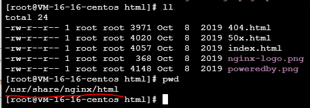

## 1. 安装nginx

    $ yum -y install nginx

## 2. 启动nginx

    $ systemctl start nginx

## 3. 检查nginx状态

    $ systemctl status nginx

输出类似于（有绿色的"active (running)"即表示已经启动)：
<pre>
[root@VM-16-16-centos ~]# systemctl start nginx
[root@VM-16-16-centos ~]# systemctl status nginx
● nginx.service - The nginx HTTP and reverse proxy server
   Loaded: loaded (/usr/lib/systemd/system/nginx.service; disabled; vendor preset: disabled)
   Active: active (running) since Tue 2021-03-02 13:26:46 CST; 6s ago
  Process: 6943 ExecStart=/usr/sbin/nginx (code=exited, status=0/SUCCESS)
  Process: 6942 ExecStartPre=/usr/sbin/nginx -t (code=exited, status=0/SUCCESS)
  Process: 6940 ExecStartPre=/usr/bin/rm -f /run/nginx.pid (code=exited, status=0/SUCCESS)
 Main PID: 6945 (nginx)
    Tasks: 2 (limit: 11508)
   Memory: 8.9M
   CGroup: /system.slice/nginx.service
           ├─6945 nginx: master process /usr/sbin/nginx
           └─6946 nginx: worker process
</pre>

## 4. 停止nginx

    $ systemctl stop nginx

## 5. 重启nginx

    $ systemctl restart nginx

## 6. 重新加载nginx

    $ systemctl reload nginx

## 7. 测试nginx启动页面

nginx启动后，可以通过浏览器访问我们的服务试试。

需要在云服务器信息页面找到公网IP。

    http://106.52.63.156

## 8. 替换默认页面

nginx服务的默认页面，存放在`/usr/share/nginx/html/`目录下的`index.html`：

## 9. 远程传输文件到CVM

1. 下载`filezilla`
2. ftp到远程主机  

        主机：远程主机的IP地址
        用户名：远程主机登录ID（和在腾讯云SSH登录时一样）
        密码：远程主机登录密码（和在腾讯云SSH登录时一样）
        端口：22

3. 现在可拖拽本地文件上传到远程主机了

## 10. 远程主机域名配置https

