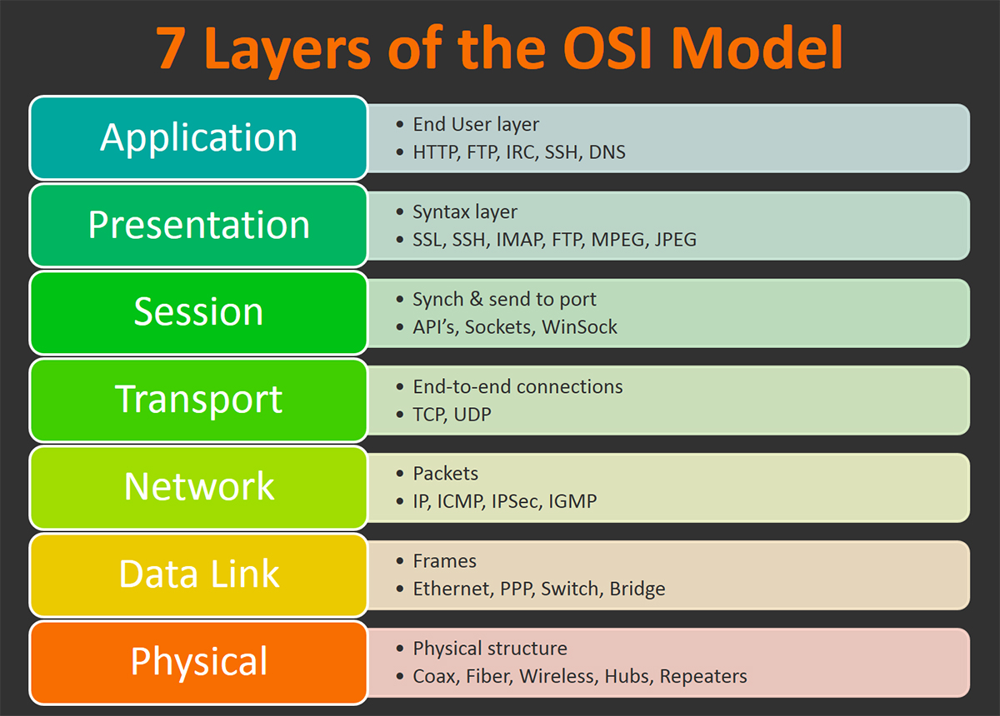

## 1、负载均衡(Load Balancer)

它作为一个反向代理角色，将请求转发到多个服务器上，以提高应用的并发能力。

负载均衡一般分为两类：Layer 4 和 Layer 7。

**Layer4(`L4`)**：基于网络层和运输层协议的数据进行，如IP、TCP、FTP、UDP；

**Layer7(`L7`)**：基于应用层协议数据进行，如HTTP。例如它可以基于HTTP请求头部的cookie来决定转发规则。

在OSI7层模型中，网络防火墙在1-3层（物理层、链路层、网络层），而负载均衡作用于4-7层（传输层、会话层、表示层、应用层）。

## 2、老司机经常提到的`L5`是什么？

**L5**: 负载均衡Layer 5，表示作用于OSI模型第五层（**会话层**）的负载均衡。