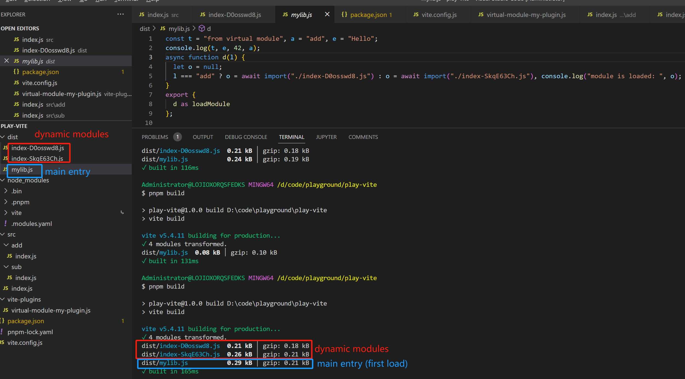
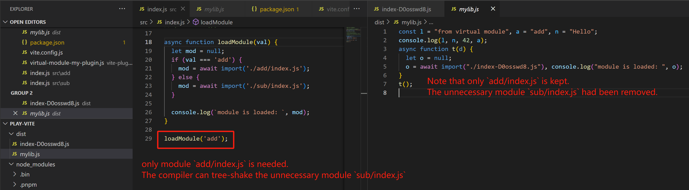
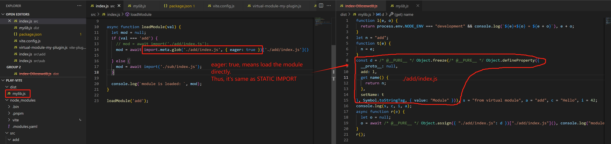
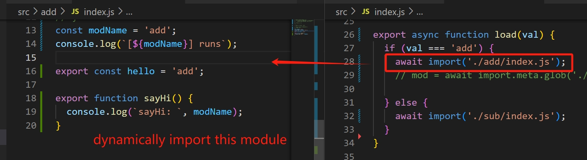
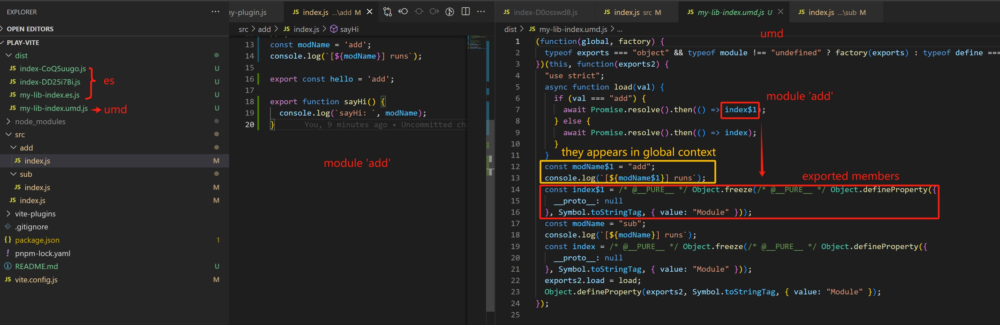
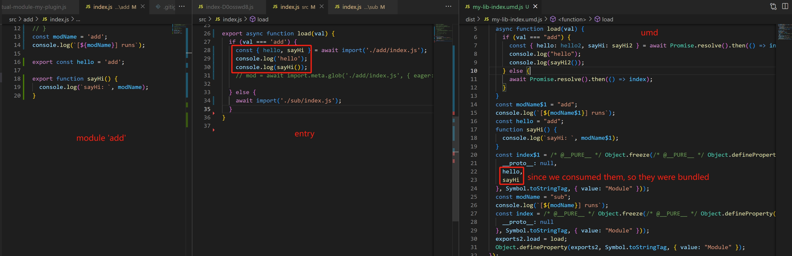
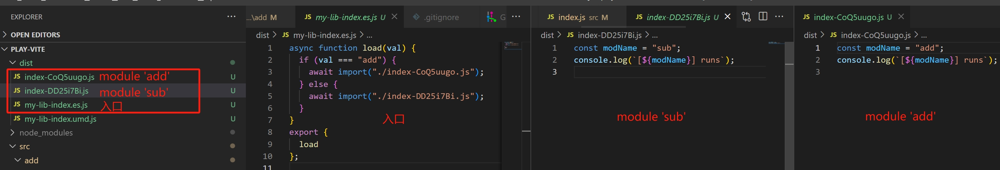

## 1. vite.config.js
导出一个对象，给defineConfig可以直接传对象，也可以给个函数，以根据条件确定不同的配置

对象
```js
export default defineConfig({
  define: {
    __APP_VERSION__: JSON.stringify('v1.0.0'),
    __API_URL__: 'window.__backend_api_url',
  },
})
```

函数
```js
export default defineConfig(({ command, mode, isSsrBuild, isPreview }) => {
  // command只能是 serve 或 build
  //   1) vite === vite dev === vite serve, command为dev
  //   2) vite build，command为build 
  if (command === 'serve') {
    return {
      // dev specific config
    }
  } else {
    return {
      // build specific config
    }
  }
})
```

vite借助esbuild的define来替换变量，dev时注入变量，build时直接替换为常量。
如果需要替换为shim（可以理解为一段代码，esbuild的解释是：an import from another file），可以用esbuild的inject。
使用场景比如说js要在node或者browser运行，那么node端的api就无法在浏览器跑。比如这段代码
```js
// entry.js
console.log(process.cwd())
```
显然，浏览器中是没有process对象的，那么为了能不改代码的前提下，能够给Node和Browser分别build，岂不美哉。
这时inject就派上用场，对Browser构建时，对entry注入process.cwd，给它定义一个空函数或者其它的，只要不crash就行了：

```js
// process-cwd-shim.js
let processCwdShim = () => ''
export { processCwdShim as 'process.cwd' }
```

```bash
$ esbuild entry.js --inject:./process-cwd-shim.js --outfile=out.js
```

```js
// out.js
var processCwdShim = () => "";
console.log(processCwdShim());
```


## 2. import.meta.env.XXX
vite内置的变量，可以在代码中引用。vite构建时会把它们替换为静态常量字符串。

- import.meta.env.MODE 表示构建的是development or production，或者是自定义其它的字符串
- import.meta.env.BASE_URL 由 vite config 中的 base 确定
- import.meta.env.PROD 是否为production构建，即当 NODE_ENV='production' 时为true
- import.meta.env.DEV 与PROD相反
- import.meta.env.SSR

在vite启动时，会加载根目录下的 `.env` files，带`VITE_`前缀的变量都会被塞到 `import.meta.env` 中，其它不会被塞进去。
```
// .env file
VITE_VERSION=123
```

## 3. `process.env.NODE_ENV` vs `mode`
这是两个不同的概念。

- `NODE_ENV` 是标准的环境变量，development 或 production，**可以在代码中当宏用 `process.env.NODE_ENV`。**
- `mode` 是vite自己定义的，更具体的mode。也可以为 development 或 production，也可以是自定义的字符串。vite会根据mode设置`NODE_ENV`，比如mode==development则设置NODE_ENV也为development。**mode主要用于动态应用vite config**。


vite dev, NODE_ENV 就是 development；vite build， NODE_ENV 就是 production。
但也可以修改，

这样build了一个development的版本
```
NODE_ENV=development vite build
```

再次注意，NODE_ENV 和 mode 是两个概念。

vite dev, mode 就是 development；vite build， mode 就是 production。

也可以修改，

这样是production build，但是mode是development
```
vite build --mode development
```

## 4. virtual modules convention
用途：源码可以引用到构建时的信息。

```js
// vite.config.js
import { defineConfig } from 'vite'
import myPlugin from './vite-plugins/virtual-module-my-plugin'

export default defineConfig({
  // ...
  plugins: [myPlugin()],
  build: {
    lib: {
      entry: './src/index.js', // act as the entry, since it's a lib, we don't have `index.html`
      formats: ['es'],
      fileName: 'mylib', // default is same as `name` in package.json
    }
  }
})
```

```js
// virtual module
export default function myPlugin() {
  const virtualModuleId = 'virtual:my-module' // virtual module的名字，可以import它
  const resolvedVirtualModuleId = '\0' + virtualModuleId // rollup的约定

  return {
    name: 'my-plugin', // required, will show up in warnings and errors
    resolveId(id) {
      if (id === virtualModuleId) {
        // 碰到import这个module，就resolve
        return resolvedVirtualModuleId
      }
      // 否则沿用原逻辑处理
    },
    load(id) {
      if (id === resolvedVirtualModuleId) {
        // 要加载这个module，就load下面这段作为module的content，即当作module的源码
        // 所以我们可以在import之处，用`msg`
        return `
          export const msg = "from virtual module";
          export const type = 'add';
          export const foo = 'Hello';
          export const bar = 42;
          export const baz = { message: 'World' };
        `
      }
      // 否则沿用原逻辑处理
    },
  }
}
```

```js
// src/index.js
import { msg } from 'virtual:my-module';

console.log(msg)
```

build后：

```js
const n = "from virtual module";
console.log(n);
```


## 5. 对vite project，`index.html`是必须的吗？
不是。

如果是app，那是需要的，index.html作为vite resolve整个app的入口，包括inject js/css/VITE_XX等；

如果是lib，那不需要它，但我们需要改一下vite的配置。
```js
export default defineConfig({
  // ...
  build: {
    lib: {
      entry: './src/index.js', // act as the entry, since it's a lib, we don't have `index.html`
      formats: ['es'],
      fileName: 'mylib', // default is same as `name` in package.json
    }
  }
})
```

## 6. vite dev / serve / preview / build

源码位置：packages\vite\src\node\cli.ts

`dev`: start dev server，然后就没做啥了

vite === vite dev === vite serve


`build`: createBuilder -> buildApp


`preview`: 本地预览production build。本质上是NODE_ENV、mode都被设置为production。但注意，command还是serve
```bash
# 先build
$ vite build

# 再preview
$ vite preview
```


## 7. dynamic import
用途：运行时才能确定加载什么资源，统统用dynamic import。
vite怎么做的：代码有用动态导入的`import(xxx)`，vite会把动态加载的module单独打包为一个文件。注意，如果代码逻辑不会执行到的地方，构建时tree-shaking也会丢掉不需要的模块。

比如index.js依赖了2个module，需要运行时才能确认，则vite打包出1个entry，2个module分别打包为一个js


如果运行时能确认有无用的module，vite会tree-shake掉它，而且最终产物只有1个entry，1个module


## 8. dynamic import产生的产物，名字后面为啥加了hash，什么含义？
dynamic import之上，vite有个特殊的语法：[import.meta.glob](https://vite.dev/guide/features.html#glob-import)

本质上还是es的import，但它可以一次性import一类module，或者仅导入指定的名称（比如exports了10个，你可以指定要某一个）

`{ eager: true }` 相当于立即导入，这和静态导入没区别了（既然是静态导入，就没有split to separated chunks了）：



## 8. public directory
用途：此目录存放那些不在源码中引用的资源。dev时，这些资源被放在dev服务的`/`根目录下；build后会原封不动地copy到dist目录下，也是通过服务端根目录路径访问这些资源。


## 9. 打包产物格式 `umd` 和 `es` 的区别
先上结论：
> umd 打包出的是一个整体，资源加载后，所有module都会被立即evaluate
>
> es 打包出的是一个入口+分包的形式，runtime才确定加载哪些module，进而对应module才会被evaluate

详解：
umd是兼容三合一的统称，cjs, iief, amd。
es是ECMAScript标准语法，比如支持import语法。

特别注意，产物是有区别的。
module中全局作用域的代码，在umd中也会出现在产物的全局作用域。比如你在module的全局作用域的代码，umd js被加载后会被立即执行。

而es则不会；每个module都是一个独立的作用域，只有当module被加载时才会执行。

比如下图，动态引入module 'add'，我们期望的是运行时加载 module 'add'，加载后才执行 module 'add' 的代码。


但对于 umd 而言，并非想象的那样。module内全局作用域的代码，都会被移动到最终的全局作用域内，即相当于umd.js加载时就会被执行。
umd产物可以理解为“all-in-one”，全都打包在一起了，不管你有没有用动态import。
那动态import怎么处理的呢？每个module本质上都是一个js对象，导出的东西都挂在这个对象上，动态import就直接转换成resolve为这个对象了。
而这个对象已经随着umd加载好了。
至于为啥`index$1`这个module没有导出的成员，我想是因为打包工具的影响，因为检测到代码没用导出的成员，所以它就是一个空对象了。

当我们用到exported成员时，构建产物中就有它了：


反观 es ，如我们的预期。产物分为主包（入口）和分包（chunks）：

module只有在runtime才会被加载，因此并不随着入口加载而执行。

