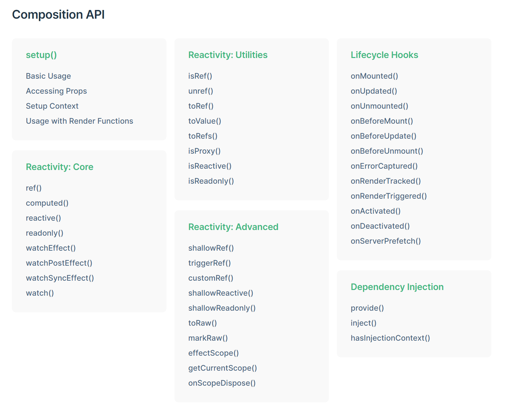

### 1.filter
过滤器，可以用于文本格式化，写在两个地方：双花括号插值和 v-bind 表达式。 

过滤器应该被添加在 JavaScript 表达式的尾部，由“管道”符号(|)指示：  

>在双花括号中  
>`{{ message | capitalize }}`
>
>在 `v-bind` 中  
>`<div v-bind:id="rawId | formatId"></div>`

局部过滤器：定义在vue组件上
<pre>
filters: {  
  capitalize: function (value) {  
    if (!value) return ''  
    value = value.toString()  
    return value.charAt(0).toUpperCase() + value.slice(1)  
    }  
  }
</pre>

全局过滤器：在创建Vue实例之前
<pre>
Vue.filter('capitalize', function (value) {
  if (!value) return ''
  value = value.toString()
  return value.charAt(0).toUpperCase() + value.slice(1)
})
</pre>

**过滤器是一个函数，总接收表达式的值作为第一个参数。**
### 2. router
#### 2.1 `<router-link>` vs `<a>`

#### 2.2 动态路由匹配
<pre>
const User = {
  template: '<div>User</div>'
}

const router = new VueRouter({
  routes: [
    // 动态路径参数 以冒号开头
    { path: '/user/:id', component: User }
  ]
})

</pre>
将会匹配/user/evan, /user/yuhui。
且可在组件内通过引用this.$route.params.id来获取到动态参数值。

#### 2.3 


### 3. 动态参数
通过中括号的形式，其内可以写一个表达式，但是不要包含空格或者引号，如果需要的话可改成计算属性来变通。

<code><a v-bind:[someAttr]="value"></a></code>

### 4. 缩写
v-bind  
<code>:href === v-bind:href</code>

v-on  
<code>@click === v-on:click</code>  
动态参数  
<code>@[event] === v-on:[event]</code>  

### 5. 计算属性
为Vue实例的选项增加一个`computed`属性，它的值是一个对象，其中可以定义多个计算属性，每个属性的值是一个函数，用来计算*计算属性*的值。

<pre>
var vm = new Vue({
  el: '#example',
  data: {
    message: 'Hello'
  },
  <span style='color:skyblue'>computed</span>: {
    // 计算属性的 getter
    <span style='color:orange'>reversedMessage</span>: function () {
      // `this` 指向 vm 实例
      return this.message.split('').reverse().join('')
    },

    // 计算属性也可以设置setter
    <span style='color:orange'>fullName</span>: {
      <span style='color:skyblue'>getter</span>: function () {
        // `this` 指向 vm 实例
        return this.firstName + ' ' + this.lastName
      },
      <span style='color:skyblue'>setter</span>: function(val) {
        const names = val.split(' ');
        this.firstName = names[0];
        this.lastName = names[1];
      },
    },
  }
})
</pre>

#### 5.1 计算属性缓存 vs 方法
同样可以将上述函数定义在Vue实例选项的`methods`上，以达到同样的效果。  

但是二者的区别在于，**计算属性是会缓存的**。  

因为计算属性是响应式的依赖，只有当所依赖的属性值发生了变化，计算属性才会重新求值。

而**函数**则不同，函数每次被访问都会调用一次来计算求值。

#### 5.2 计算属性 vs 侦听属性
**什么是侦听属性?**

侦听属性是指在Vue实例选项中的`watch`对象。

`watch`对象中的每个`key`都是**被侦听**的属性，而其`value`则是一个函数，当`key`发生变化时该函数就会被执行。这个函数就执行修改某个依赖属性的值的操作。

<pre>
// 例子：vue实例选项，fullName依赖于两个值firstName/lastName

// 方法一：用watch(deprecated)
...,
watch: {
  firstName: function(val) {
    this.fullName = val + ' ' + this.lastName;
  },
  lastName: function(val) {
    this.lastName = this.firstName + ' ' + val;
  },
}

// 方法二：用computed(better)
...,
computed: {
  fullName: function() {
    this.fullName = this.firstName + ' ' + this.lastName;
  },
}
</pre>

### 6. Class与Style绑定
这俩属性比较特殊，绑定的表达式结果值可以是*字符串*、*对象*、*数组*。

#### 6.1 Class对象语法

`v-bind:class="{ active: isActive, 'text-danger': hasError }"`

`active`这个样式类是否应用，取决于property`isActive`的值是否为`true`。

同样地，`text-danger`也是一样，依赖于`hasError`的布尔值。

不必内联将对象写到模板里，可以如此（注意`key`是*className*, `value`的值应该是布尔类型）：

// 模板  

`v-bind:class="classObject"`

// 实例数据
<pre>
data: {
  classObject: {
    active: true,
    <span style='color:#42b983'>'text-danger'</span>: true,
  },
}
</pre>

如此一来，最后应用的样式等价于

`class='active text-danger'`

**一种强大的模式：为`class`绑定一个是计算属性的对象：**

（也就是当样式修改比较复杂时，可以考虑用计算属性来做）

`v-bind:class='classObject'`

<pre>
data: {
  isActive: true,
  error: null,
},
computed: {
  classObject: function() {
    return {
      active: this.isActive && !this.error,
      'text-danger': this.error && this.error.type === 'fatal'
    };
  },
}
</pre>

#### 6.2 Class数组语法

`v-bind:class="[activeClass, errorClass]"`

<pre>
data: {
  activeClass: 'active',
  errorClass: 'error',
},
</pre>

以上等价于

`class='active error'`

因为`v-bind:class`是一个表达式，因此里面可以写简单的逻辑，如

`v-bind:class="[isActive ? activeClass : '', errorClass]"`

即当`errorClass`固定会添加，而`activeClass`是否添加，是由`isActive`这个property决定的。

也可以这么写（在数组语法中使用对象语法），

`v-bind:class="[{ active: isActive }, errorClass]"`

**自定义组件上写的`className`，最终会添加到自定义组件的*根元素*上，并且*不会被覆盖***

#### 6.3 style对象语法

`v-bind:style="{ color: someColor, 'font-size': fontSize + 'px' }"`

*注意：css property可以用camelCase(`fontSize`)或者kebab-case，但注意kebab-case需要加上引号(`'font-size'`)*

<pre>
data: {
  someColor: 'blue',
  fontSize: 20, // 或者'font-size'
}
</pre>

等价于，

`style="color: blue; font-size: 20px"`

#### 6.4 style数组语法

`v-bind:style="[baseStyles, overriddingStyles]"`

### 7. v-if vs v-show

`v-if`: 不需要频繁切换时使用(需要时Add,不需要时Remove)

`v-show`: 需要频繁切换时使用(保持在DOM中,通过修改`display`实现，`display:none`)

**对于隐藏而言，`v-if`比`v-show:false`代价要高！**

因为`v-if`是条件渲染，不需要渲染时，**根本就不插入DOM**。

而`v-show`因为是用`display:none`来控制的，`style`只是影响到样式的表现(CSSOM, 即CSS-Object-Model)，并不会影响DOM树。

因此，`v-if`根本就不插入DOM，从而不会渲染；`v-show`则存在于DOM中，当需要隐藏时，渲染树得到`display:none`，最终渲染出来的`render tree`是不含这个元素节点的。

`v-if/v-else/v-else-if`

#### 7.1 key

以下HTML，如果没有`key`，则Vue的元素复用机制将会导致`v-if`切换时，input的值仍然残留。

原因是Vue会尽可能复用相同元素，<i style='color:#006fff'>猜测</i>这里因为结构相同（都是`<label>`和`<input>`），所以切换时DOM元素仍保持在DOM树中，而仅仅更改节点元素的属性。

*感觉像是DOM没变，只是用Object.assign修改了属性？*

**TODO: 看下源码吧!**

```html
<template v-if="loginType === 'username'">
  <label>Username</label>
  <input placeholder="Enter your username">
</template>
<template v-else>
  <label>Email</label>
  <input placeholder="Enter your email address">
</template>
```

如果希望不要复用`<input>`，则应给它指定一个`key` attribute

?? 这里的`key`为啥不是`v-bind:key`？和`v-for`中的`v-bind:key`有何区别？

```html
<template v-if="loginType === 'username'">
  <label>Username</label>
  <input placeholder="Enter your username" key="username-input">
</template>
<template v-else>
  <label>Email</label>
  <input placeholder="Enter your email address" key="email-input">
</template>
```

### 8. 列表渲染：v-for

遍历数组
```html
<li v-for='item in items' :key='item.uniqueKey'>{{ item.message }}</li>

<li v-for='(item, index) in items' :key='item.uniqueKey'>{{ item.index - item.message }}</li>
```

遍历对象
```html
<li v-for='(value, prop, index) in someObject'>{{ index }}. {{ prop }} : {{ value }}</li>
```

#### 8.1 for...in vs for...of

**```for...in```**

遍历一个对象的所有**可枚举**属性，这些属性是用`String`来作为key区分的，且继承而来的属性也会被遍历到。

<pre>
const object = { a: 1, b:2, c:3 };
for (const prop in object) {
  // prop: 'a'/'b'/'c'
  // value can get from object[prop]: 1/2/3
}
</pre>

**最佳实践：**
> 不要在遍历过程中Add/Modify/Delete属性。  
> 不要为数组使用`for...in`(因为此语法是遍历可枚举的属性，并不保证顺序。而且遍历时的*variable*是**数组下标**！)  

**```for...of```**

遍历一个**可迭代**的对象，如内置的`Array`、`String`、`Array-Like Object`(e.g., arguments)、`Map`、`Set`等。

可通过`break`、`return`跳出。

<pre>
for (let value of ['a', 'b', 'c']) {
  // value: 'a'/'b'/'c'
}

for (let value of 'abc') {
  // value: 'a'/'b'/'c'
}
</pre>

#### 8.2 数组更新检测

Vue覆盖(通过`Object.defineProperty`实现Array.prototype上方法的Modify)了几个数组方法，以达到为数组调用方法时能够更新视图的目的。

**变更数组的方法**如`pop`、`push`、`shift`、`unshift`、`splice`、`sort`、`reverse`等。(splice修改数组，而slice不修改数组)

**非变更数组的方法**如`filter`、`concat`、`slice`等。

> Q: 以上有何区别？  
> A:   
> 变更数组的方法会将修改直接反应到View上（因为*修改*本身就更倾向于更新View的目的，所以Vue为其添加了Observer）；而非变更数组的方法，因为这些方法并不改变原数组，Vue并不知道你要做啥，你可能拿着返回的新数组do sth。  
> 所以当需要用返回的新数组代替原数组时，直接替换即可，如：  
> <pre>example1.items = example1.items.filter(function (item) {
>   return item.message.match(/Foo/)
> })</pre> 
> `??` 不过，官网的这句存疑："所以用一个含有相同元素的数组去替换原来的数组是非常高效的操作。"

**// 所有存疑的都用`??`来标识，日后都fix掉**

`??` 翻源码看到array.js中修改以上方法时，value函数内部`this`上有个 **\_\_ob\_\_**，这是啥？

Under the hood, Vue.js attaches a hidden property **\_\_ob\_\_** and recursively converts the object’s enumerable properties into getters and setters to enable dependency collection. Properties with keys that starts with `$` or `_` are skipped.

**For the object that you want to be observed, Vue creates a `Observer` for it so that updates will be fired as soon as the object changes.**

#### 8.3 深入响应式原理

> **WARNING**: Vue不能检测数组和对象的变化

##### 8.3.1 修改数组

<pre>
vm.myArray[i] = newVal; // 👎非响应式</pre>

当通过上面的方式修改数组时，Vue是无法感知到的（Vue只能通过上面所提到的"**变更数组的方法**"来实现劫持更新）。

应当换成：

方法一：  
<pre>
  vm.myArray.splice(i, 1, newVal); // 👍响应式
</pre>

方法二：  
<pre>
  Vue.set(vm.myArray, i, newVal); // 👍响应式
  
  // or，因为对象实例上的$set方法是全局方法Vue.set的一个别名
  vm.$set(vm.myArray, i, newVal); // 👍响应式
</pre>

#### 8.3.2 修改对象

> **WARNING**: 要想让数据变成响应式的，在创建Vue实例时需要直接将数据提前声明好，哪怕它的值还不确定。

🤦‍: 为啥？

👨: 你说为啥？

👨: **因为在创建一个Vue对象时，Vue会对构造函数中的`data`属性遍历性地添加`getter`/`setter`来令它们成为响应式的。**

🤦‍: 给你看看我代码
<pre>
var vm = new Vue({
  data:{
    a: 1,
    b: {
      favor: 'apple',
    }
  }
})

// `vm.a`、`vm.b.favar` 是响应式的

vm.b.dislike = 'durain'; // 👎 `vm.b.dislike` 是非响应式的 `??`为啥测试的html可以。。

vm.c = 2; // 👎 `vm.c` 是非响应式的
</pre>

🤦‍:
新添加的属性为啥不是响应式的？

我想为已经定义好的对象`b`，添加新的属性`dislike`为啥不行？  
我还想为data新增一个**根级别**属性`c`为啥不行？

👨:
> 因为Vue不允许**动态添加**根级别的响应式属性(这里就是`c`)。
> 
> 但对于**嵌套对象**，是可以用`Vue.set(object, propertyName, value)`方法向它(如这里`b`是嵌套对象，因为`b`是一个对象，而不是一个字面量)添加响应式 property。

所以，

**向非根级别对象(也就是嵌套对象)添加属性的正确做法：**

<pre>
Vue.set(vm.b, 'dislike', 'durian'); // 向data的对象属性'b'添加一个新的属性'dislike'，它初始化为'durain'

// or
vm.$set(vm.b, 'dislike', 'durian');
</pre>

🤦‍: **如果要给`b`添加多个属性呢？** 这样行不行：
<pre>
Object.assign(vm.b, { dislike: 'durain', 'mostLike': 'banana' };
</pre>

👨: 不行，这样等价于
<pre>
vm.b.dislike = 'durain';
vm.b.mostLike = 'banana';
</pre>
添加到`b`上的新属性`dislike`和`mostLike`不会成为响应式的。

要么多写几次`Vue.set`，要么就重新给`b`设置一个新的对象吧：

**正确的做法：**
<pre>
// 法一：通过Vue.set设置(当然也可以改为vm.$set)
Vue.set(vm.b, 'dislike', 'durian');
Vue.set(vm.b, 'mostLike', 'banana');

// 法二：干脆重新给b赋值（因为b是响应式的）
const newb = Object.assign({}, vm.b, { dislike: 'durain', 'mostLike': 'banana' });
vm.b = newb;
</pre>

### 8.3.3 Vue是如何追踪变化的

当把一个javascript对象作为`data`传给Vue实例时，Vue会遍历此对象的所有property，并使用`Object.defineProperty`将他们转为`getter`/`setter`。

这样一来，`data`对象下的所有properties都会变成响应式的。

<pre>
const vm = new Vue({
  data: {
    a: 1,
    b: {
      favor: 'apple',
      c: {
        today: '2020-07-16',
        time: '13:41',
        location: 'Tencent Headquarters SZ',
      }
    },
    dislike: ['orange', 'pineapple'],
    students: [
      { name: 'xiaohan', gender: 'female', favor: 'cherry' },
      { name: 'yuhui', gender: 'male', favor: 'xiaohan' },
    ],
  },
  ...
});

vm.a = 2; // 👍
vm.b.favor = 'banana'; // 👍
vm.b.c.today = '2020-07-17'; // 👍，修改c的属性
vm.b.c = { Today: '2020-07-16' }; // 👍，重新修改了c
vm.b.c.weather = 'sunny'; // 👎，你上面白学了？
vm.$set(vm.b.c, 'weather', 'sunny'); // 👍，就你学的好
vm.dislike.push('grape'); // 👍，push是数组的变更方法，Vue有劫持
vm.dislike[0] = 'mango'; // 👎，好好想想！dislike本身这个属性是响应式的，但是因为它是一个数组，它里面的值并不是响应式
vm.dislike.splice(0, 1, 'mango'); // 👍
vm.students[0].favor = 'yuhui'; // 👍，容易迷惑！

// 👍
vm.students[0].favor = 'yuhui'; // first, change data
vm.$set(vm.students, 0, vm.students[0]); // second, update using vm.$set


</pre>

### 9. `<script setup>`
theory:
the code inside it is compiled as the content of the component's `setup()` function.

what is `setup()` function?
when you provide a setup function in options for vue component like
```
export default {
  setup() {
    // ...
  },
  // ...
}
```
vue will run the setup function at init stage(right before event 'created', but after 'beforeCreated'). The return value should be either function or an object.
- if you provide a function as return value, this function will be set as `render` option on current vue instance
- if you provide an object, vue will iterate each of the key and add them to vue instance, and do wrap/unwrap stuff for `ref` if the value of that key is type of `ref`.(through Object.defineProperty)

in single word, add the returned props on vue instance and unwrap for `ref`.

after setup done, vue will init data. Which is the data option we defined.
vue invoke `defineReactive` for each key in data(which uses Object.defineProperty).


1. syntatic suger in compile-time
2. more succinct code
3. code inside it would be ran every time an instance of the component is created, instead of runnig only at the first import
4. use the imported function directly in template, instead of put it into `methods` first
5. any top level variables are accessiable to template
6. local custom directives should be named as `vNameOfDirective`
7. `defineProps()`, `defineEmits()`, `defineExpose()`, `withDefaults()` are just **COMPILER MACROS**, only used in this script. accept same values passed to `props` & `emits` options.
8. `this` is not allowed in setup function. because the vue runtime gives it a `null` to act as the context
9. you can think of setup as similar as created when talked about the lifecycle

1.defineProps
```ts
<script setup lang="ts">
  // way1
  defineProps({
    title: String,
    likes: Number
  })

  // way2
  defineProps<{
    title?: string
    likes?: number
  }>()
</script>
```

2.defineEmits: define what events we are gonna emit from this component. Note that we cannot use `$emit` in setup script which but can be used in template.
```ts
<script setup lang="ts">
// way1: events no validation if defined with array
const emit = defineEmits(['inFocus', 'submit'])

function buttonClick() {
  emit('submit')
}

// way2: events validation
defineEmits({
  click: null, // no validation
  submit: (payload) => {
    // valid, emit
    if (do sth if ok) {
      return true
    }

    // invalid, won't emit
    return false
  }
})

// way3: 
const emit = defineEmits<{
  (e: 'change', id: number): void
  (e: 'update', value: string): void
}>()
</script>
```

3.defineExpose: used to define exported values, provided for who wants to use when they can get instance of current vue instance
```ts
<script setup lang="ts">
import { ref } from 'vue'
const a = 1
const b = ref(2)
defineExpose({
  a,
  b
})
</script>
```

4.withDefaults: used to help define **default value** for props
```ts 
<script setup lang="ts">
export interface Props {
  msg?: string
  labels?: string[]
}
const props = withDefaults(defineProps<Props>(), {
  msg: 'hello',
  labels: () => ['one', 'two']
})
</script>
```


1. the options passed to both **cannot** reference any local variables because the two will be **hoisted** out of the setup into module scope. Thus, they can reference anything inside module scope
2.  `[withDefaults](https://vuejs.org/api/sfc-script-setup.html#default-props-values-when-using-type-declaration)` used to combine with type declaration to enable default values for props
3.   `defineModel` (3.4+), can be used with `v-model`
4.   `defineExpose` ??
5.   `defineOptions` (3.3+) ??
6.   `defineSlots` ??
7.   variables created inside are **NOT** added as properties to the component instance ??
8.   `await` can be used since they would be compiled as `async setup()` function

### 10. `Options API` vs `Composition API`
Options API: in SFC a component has all its data/method etc under single option, the data/method etc of different work placed in same place, which causes **difficult to find out a relative logic code in single one place**, but requires us to slide up and down to find them.

Composition API: separate the code of a component into different modules that are relatively independent of each other. It benefits us to maintain the single logic in only 1 file. But the drawback is **difficult to get on this to separate into module**, it's absolutely not friendly to many developers.

How to choose:
  small & medium projects -> use options API is fine
  large projects -> composition api helps in maintainability


### 11. `mixins` vs `composable`
good article: https://vueschool.io/articles/vuejs-tutorials/what-is-a-vue-js-composable/

mixins 之于 Options API，相当于 composable 之于 Composition API

> composable: a "composable" is a function that leverages Vue's Composition API to encapsulate and reuse stateful logic. (reusable code logic using composition API)


1. they all are the technic to reuse code logic
2. composable does better
3. problem: data source obscured. For mixins, you don't know from which mixin does the data comes; but composable does, it requires you to import and destructure the imported object to get it explicitly
4. problem: naming collisions. For mixins, you must be afraid of same names appear in mixins; but for composable, the composables are independent, it's up to you!
5. problem: cannot safeguard it's own reactive data. For mixins, the data is mixined with the data of consuming component which lead to unexpected change caused either by module itself or the component. It's a mess actually! For composable, we can expose the reactive data by wrapping them with `readonly` api from `vue`

**vue2.7中，mixins是怎么merge的？**
就像普通对象的merge，不同key有不同的merge策略。
  data: 递归合并（深度，即如果某个value也是对象，对这个对象也进行merge），冲突时取组件的
  props/methods/inject/computed: 合并，冲突时使用组件本身的
  life cycle hooks: 合并为数组，component自己的放在末尾，所以hook被调用时，先调mixins的最后调component自己的
  provide: 和data逻辑类似，但**不是递归**，即如果同名，则直接覆盖了。比如{a: {b: 1, c: 2} }, {a: {b:2} }，结果是{a: {b:2} }
  watch: 同名的watch合并为数组，也是按 mixins声明的先后顺序调用，最后调component自己的

vue组件实例是怎么创建的？
1. 写的.vue文件，一般export都是一个对象`ctor`（当然也可以是Component, Function），接着调用到 createComponent 函数
2. createComponent -> Vue.extend(extendOptions)，这里的`extendOptions`就是 vue组件的options对象
3. 在 Vue.extend函数中，调用了 mergeOptions(super.options, extendOptions)，翻译过来就是 mergeOptions(vue基类的options，你组件的options)
4. 即，把你组件的options merge到基类上，最终的options挂在你的组件实例
5. mergeOptions是 先把组件的mixins挨个merge到super，当所有mixins merge完毕，最后把组件options merge过去。这就是为什么说生命周期钩子函数挨个执行，最后执行组件自己的。
6. 随后，Sub是一个函数类（VueComponent），new它时会调用到 Vue._init。


### 12. Composition API vs React Hooks
ref: https://vuejs.org/guide/extras/composition-api-faq.html
(感觉vue净吹vue好，react难用)

react hooks:
1. need to set `deps` for hooks(useMemo, useCallback, etc) manually, which leads to bug even for seasoned react users; composition api has vue fine reactivity system that track dependencies at first run
2. hooks need understanding about `stale` state because of closure; the composition api has no problem to worry about
3. hooks runs in fixed order; composition api has no such limitation
4. hooks runs every time the component updates; composition api only once
5. react hooks may caused unnecessary updates if not used correctly; composition api no problem because only dependencies REALLY update can cause update

### 13. Composition API


Reactivity Core
1. ref
将参数reactive化，返回一个RefImpl对象。
读这个对象的`value`时，返回一个Proxy，它是对你才传入参数的代理，可以认为是你传入的参数。
每次get（`myRef.value`）都会收集依赖（track），每次set（`myRef.value = xx`）都会trigger effect（触发依赖了它的effec函数）
注意，要通过`myRef.value`来引用到你传入的参数。
2. computed
3. reactive
和ref类似，最主要的两点：
- ref接收primitive、object；reactive只能接收object。这里的object是指 `typeof xxx` 结果为object的，数组也算
- 只不过reactive直接返回proxy而不是RefImpl对象了

为啥ref返回一个包裹的，reactive却不？


ps: 那ref vs reactive有啥区别？
- ref要用.value，reactive不用。因为reactive直接返回proxy，可以直接引用
- ref在js/template写法不同（.value/no .value），后者一致都是直接用
- ref可接受primitive，后者只能接受对象（否则返回参数，相当于啥都没做）
- 当参数是object，后续需要reassign时用ref（要直接修改时比如：myRef.value = xxx，这相当于修改对象了），否则用reactive
- 后者不可以destructure（解构赋值），这样会丢失响应式状态，即set后没反应，应为解构的就变成了普通变量。额。why？？

为啥要用ref?
因为我们要track、trigger一个变量，js中无法直接对一个plain variable这样做，得包到object里才可以。


1. readonly
用proxy包裹参数，返回一个readonly的proxy
1. how does watchEffect know what state to track?
2. watchEffect vs watch

Reactivity Utilities
1. toValue


Lifecycle Hooks
1. onMounted()
2. onUpdated()
3. onUnmounted()

### 14. vue2.7 vs vue3
|-|2.7|3|common|
|-|-|-|-|
|ref|returns a plain object|returns a RefImpl instance|myRef.value|
|reactive|cannot pass array as it would not be tracked in watch; doesn't support collection types like Map / Set; |-|not for primitive|
|-|-|-|-|

### 15. $nextTick

use microtask to schedule callback in an array, the callback array would be flushed (ran one by one) in the microtask checkpoint.

when you invoke $nextTick many times, each time you invoke, the callback is just pushed into the callback array, and nothing happens until next checkpoint for microtask.

### 16. Vuex: dispatch
内部执行逻辑：
从内部维护的`_actions`，取`type`对应的`actions`（一个数组）依次执行，参数就是payload，用Promise.all包裹。
返回一个promise，成功时就是各action的返回值；失败时，就reject第一个失败的action的error。

因此，action是可以写异步逻辑的，而且dispatch返回值也是一个promise，那么也可以等dispatch结束后再do sth:
```js
const resOfActionA = await dispatch('actionA')
const resOfActionB = await dispatch('actionB')
// ...
```

内部的`_actions`是一个plain object，通过`registerAction`注册action handler。对同type进行多次注册就会形成一个数组了。
```ts
_actions: {
  [action_type: string]: function[]
}
```

你传入的handler会被wrap，把handler的返回值转成Promise返回。
```js
// register `handler` for `type`
const entry = store._actions[type] || (store._actions[type] = [])
entry.push(function wrappedActionHandler (payload) {
    let res = handler.call(store, {
      // local
      dispatch: local.dispatch,
      commit: local.commit,
      getters: local.getters,
      state: local.state,

      // root
      rootGetters: store.getters,
      rootState: store.state
    }, payload)

    // covert to Promise
    if (!isPromise(res)) {
      res = Promise.resolve(res)
    }

    return res
})
```

注意handler的第一个参数对象，它的dispatch / commit / getters / state都是local，如果想dispatch到其它module，要用root store上挂的方法来做：
```js
// in module A
function myAction({ dispatch }) {
  // ❌ DO NOT USE LOCAL to dispatch
  dispatch('moduleB/someAction')

  // ✔ this is the function bound to root store
  this.dispatch('moduleB/someAction')
}


// in module B
function someAction({...}) {
  // ...
}
```

什么时候调的`registerAction`？
在store初始化时，调installModule(root)，这是一个递归的过程，其中会先注册actions/getters/mutations，而后递归install子module。
vuex内部主要有几个对象：Store，ModuleCollection，Module。Store是对外暴露的，Store的成员变量_modules可以理解为是一个树的根节点，注册的过程会创建各个module，形成一棵module collection树。
不同层级的嵌套都是注册到store内部同一个对象上，只不过key不同。key可以反应嵌套的路径，这个路径是通过path加斜杠`/`连接表达。比如`/foo/train/bwc`。


### 17. Vuex: commit
内部执行逻辑：
从内部维护的`_mutations`，取`type`对应的`mutations`（一个数组）依次执行，参数就是payload，同步代码。


### 18. Vuex: 构建过程
每个module形如:
```js
{
  namespaced, // boolean
  state, // function or plain object
  getters,
  actions,
  mutations,
}
```
每个module可以通过addChild添加它的子module。

在installModule时，是一个递归的过程。
把mod（module的简称）的state挂在

### 19. Vuex 4 要求 Vue ^3.0.2
```json
// in vuex 4.0.0
"peerDependencies": {
  "vue": "^3.0.2"
},
```

### 20. Vue.set(obj, key, val)
vue 2.7里，本质上就干了一件事：
  若obj是数组，则直接设置`obj[key]=val`
  否则，
    第一次调用Vue.set添加属性的话，
      调用 `defineReactive` 在obj上定义一个reactive property，即 `obj[key] = val`。而后触发obj.dep.notify()，表示新属性添加到了obj上。
    非第一次调用Vue.set，则直接简单赋值即可。因为属性已经存在，业已是reactive了。

故，
1. obj应是reactive的，否则只是普通赋值
2. 新添加属性，obj的deps应该会收到反应才对
  
### 21. vm.$emit(eventName)
触发事件，同步执行的。
取vm上的_events，从中找匹配eventName的callbacks，拿出来挨个执行。
注意，callback如果是异步的（即async），$emit也只是触发执行，不会await它，也没必要await。
学习下人家catch callback异常的写法：
```ts
function invokeWithErrorHandling(
  handler: Function,
  context: any,
  args: null | any[],
) {
  let res
  try {
    res = args ? handler.apply(context, args) : handler.call(context)
    if (res && isPromise(res)) {
      res.catch(e => console.error(e))
    }
  } catch (e) {
    console.error(e)
  }
  return res
}

function isPromise(val: any): val is Promise<any> {
  return (
    isDef(val) &&
    typeof val.then === 'function' &&
    typeof val.catch === 'function'
  )
}

export function isDef<T>(v: T): v is NonNullable<T> {
  return v !== undefined && v !== null
}
```

### 22. vue修改一个属性，而后响应式系统是怎么处理的？
假设这个属性是一个reactive state，每个reactive state都有对应的Dep对象。
Dep理解为这个属性是一个observable，而依赖了这个属性的那些称之为observer，也就是用Watcher对象关联。比如我们写了一个computed属性，你会有一个函数来运行，它的返回值作为这个属性的值。vue会在初始化阶段，为这个computed属性创建一个watcher，watcher内维护了一个getter，这个getter就是你提供的函数。
函数运行一次，所引用的reactive state都会触发Dep来收集依赖，即Dep知道有一个watcher依赖我。

在某时刻，这个reactive state发生变化，即每次set后，会触发Dep.notify。notify会调用到watcher的update方法，最后会将这个watcher丢到queue里，而这个queue会在nextTick flush。

nextTick的实现是利用promise，即nextTick就schedule了一个微任务而已。当然，如果环境不支持，则会尝试用`MutationObserver`，还不支持？就用setTimeout兜底。

回到响应式系统的更新，当nextTick到达，queue被flush。每个watcher被取出来执行watcher.run。
watcher.run此时先调用getter（即你提供的函数）计算一边最新的value，然后和oldValue对比，相同则啥都不做（如果是value是对象则例外）。

value不同，则要触发callback。注意对computed而言，没有callback，因为initComputed的时候，给cb是noop。
而对watch而言，cb是你给的callback，getter则是你指定watch的目标，比如给的"a.b.c"则内部会设置getter取vm上这个层级的数据；如果给的是function，就和computed类似了，watch的对象是一个function返回的结果，这有点像是不用定义computed属性，而直接在watch这里提供原本要给computed传的function。
```ts
vm.$watch(
  // expOrFn, act as getter
  function () {
    return this.a + this.b
  },
  // cb
  function (newVal, oldVal) {
    
  }
)
```

# 附: Vue源码学习
## 0. Vue是如何初始化的？
### 0.1 init
1. 对象内部维护一个整型计数，`_uid`++
2. 有提供`_isComponent`时调初始化内部component；否则合并options赋值给`$options`
3. initLifecycle:
4. initEvents:
5. initRender:
6. 调用生命周期钩子函数`beforeCreate`
7. initState:
8. initProvide:
9. 调用生命周期钩子函数`created`
10. 如果`$options.el`存在，则调用vm.$mount方法
## 1. Vue是如何追踪数据变化的
Vue创建一个实例时，会将传入的option.data对象，对其每一个属性，定义到vm._data上并使之成为响应式的：
<pre>
const keys = Object.keys(data)
let i = keys.length
while (i--) {
  const key = keys[i]
  proxy(vm, `_data`, key) // key是定义到_data上的，即vm._data.reactiveProp = 5;
}
</pre>

## 2. Watcher
Watcher是Vue中的一个类，它解析一个表达式、收集其依赖项，当表达式的值发生变化时，指定的回调函数会被执行。

**目的：暂时没想到什么好的应用场景。**

用于`$watch()`API和`指令`。

### 2.1 `$watch()`API
用法：在Vue创建实例给定选项`watch`，以监听表达式值的变化，从而触发回调函数执行。
<pre>
var app4 = new Vue({
  data: {
    a: 1,
    b: 2,
    c: 3,
    d: 4,
    e: {
      f: {
        g: 5
      }
    }
  },
  watch: {
    a: function (val, oldVal) {
      console.log('handler for a: ', val, ', ', oldVal)
    },
    // string method name
    b: 'someMethod',
    // the callback will be called whenever any of the watched object properties change regardless of their nested depth
    c: {
      handler: function (val, oldVal) { /* ... */ console.log('handler for c:',val, ', ', oldVal); },
      deep: true
    },
    // the callback will be called immediately after the start of the observation
    d: {
      handler: 'someMethod',
      immediate: true
    },
    // you can pass array of callbacks, they will be called one-by-one
    e: [
      'handle1',
      function handle2 (val, oldVal) {
        console.log('handle2: ',val, ', ', oldVal);
        /* ... */
      },
      {
        ar: function handle3 (val, oldVal) { 
          /* ... */ 
          console.log('handle3: ',val, ', ', oldVal);
        }
      }
    ],
    // watch vm.e.f's value: {g: 5}
    'e.f': function (val, oldVal) { console.log('e.f') /* ... */ }
  },
  methods: {
    someMethod: function() {
      console.log('i am someMethod');
    },
    handle1: function() {
      console.log('i am handle 1');
    },
  }
})

app4.a = 2; // handler for a...
app4.b = 3; // i am someMethod
// app4.c 因定义了deep=true，所以如果c是一个Object，只要内嵌属性发生变化就会触发
</pre>


